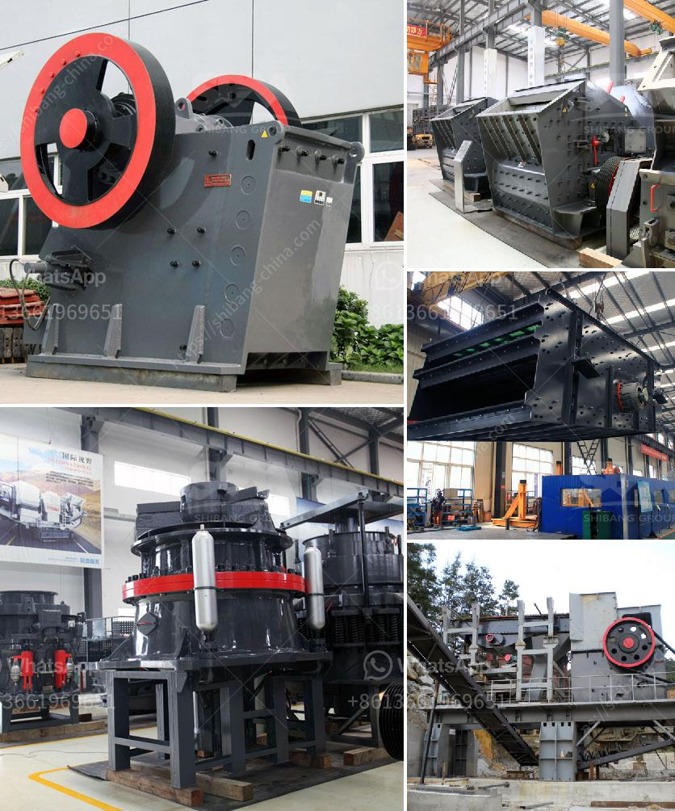

<h3>china gold dry washer manufacturer in australia</h3>
China's rapidly growing industrial landscape has played a pivotal role in the global economy, with numerous manufacturing sectors experiencing significant growth. One such sector, the gold mining industry, has witnessed unprecedented expansion in recent years. China's gold mining capabilities have reached new heights, leading to the emergence of prominent manufacturers like Goldmaster, a renowned gold dry washer manufacturer. With an already established presence in China, Goldmaster has recently expanded its operations into Australia, cementing its position as a global leader in gold dry washer manufacturing.

Gold dry washers are essential tools used by gold prospectors and miners to separate valuable gold particles from other materials, such as soil or sand. These machines utilize a combination of vibration, gravity, and airflow to efficiently extract gold nuggets, flakes, and dust. Gold dry washers have become increasingly popular due to their ability to recover gold from dry material, eliminating the need for water, and providing a more sustainable mining solution.

Australia, known for its vast mineral resources and thriving mining industry, was a natural choice for Goldmaster's expansion. The country boasts diverse mineral deposits, including substantial gold reserves, making it an ideal market for gold dry washers. By expanding into Australia, Goldmaster aims to tap into the thriving mining industry and cater to the evolving needs of gold prospectors and miners.

Goldmaster's decision to enter the Australian market aligns with China's commitment to the Belt and Road Initiative (BRI). The BRI aims to enhance international connectivity and cooperation across continents, with a focus on infrastructure development and transnational trade. By establishing a presence in Australia, Goldmaster contributes to the strengthening of trade ties between China and Australia, fostering economic growth and cooperation under the BRI framework.

With its expertise and cutting-edge technology, Goldmaster is set to revolutionize the Australian gold mining industry. The company's gold dry washers are designed to deliver exceptional performance, combining durability, efficiency, and ease of use. By focusing on innovation and implementing advanced manufacturing processes, Goldmaster ensures that its products meet the highest quality standards, enabling gold miners and prospectors to maximize their yields.

Goldmaster's expansion into Australia brings many benefits to the local market. Firstly, it provides miners with access to technologically advanced and reliable gold dry washers that improve efficiency and productivity. Additionally, Goldmaster's presence in Australia creates job opportunities and drives economic growth in the mining sector.

Furthermore, Goldmaster's expansion sparks healthy competition among manufacturers, encouraging innovation and product development. Local manufacturers in Australia will have the opportunity to learn from Goldmaster's expertise and adapt their own products to meet the evolving needs of the mining industry.

In conclusion, Goldmaster's expansion into Australia signifies its growing influence as a global leader in gold dry washer manufacturing. With its advanced technology, commitment to quality, and dedication to sustainable mining practices, Goldmaster is well-positioned to meet the demands of the Australian market. The company's presence will undoubtedly contribute to the growth and development of the Australian gold mining industry while strengthening trade ties between China and Australia.
<h3>Contact us</h3><ul><li><strong>Whatsapp:&nbsp;<a href="https://wa.me/8613661969651">+8613661969651</a></strong></li><li><a href="https://swt.shibang-china.com/?git&amp;zhl&amp;china gold dry washer manufacturer in australia"><strong>Online Service(chat now)</strong></a></li></ul><h3>Related</h3><ul><li><a href='used gold mining equipment for sale in south africa.md'>used gold mining equipment for sale in south africa</a></li><li><a href='cost of vertical roller mill clinker grinding.md'>cost of vertical roller mill clinker grinding</a></li><li><a href='iron ore crusher machine price.md'>iron ore crusher machine price</a></li><li><a href='coal pulverizer manufacturers in south africa.md'>coal pulverizer manufacturers in south africa</a></li><li><a href='german cement grinding unit operations.md'>german cement grinding unit operations</a></li></ul>