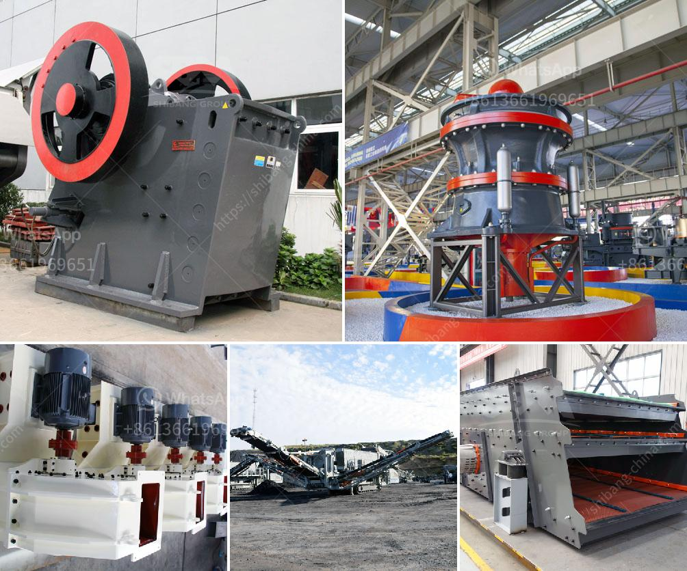

<h3>china gold dry washer manufacturer in philippines</h3>
The mining industry in the Philippines has been thriving since the discovery of gold in the early 16th century. As one of the most mineral-rich countries in the world, it comes as no surprise that the Philippines is a leading producer of gold, copper, and nickel. With the increasing demand for these precious metals, the need for advanced mining equipment has also grown significantly. This has paved the way for China gold dry washer manufacturers to enter the Philippine market.

China has long been recognized as a global manufacturing hub, producing a wide range of products ranging from electronics to heavy machinery. As the demand for mining equipment continues to rise, Chinese manufacturers have identified an opportunity to expand their presence in countries like the Philippines. One such equipment that has gained popularity in the mining industry is the gold dry washer.

A gold dry washer is a specialized piece of equipment designed to efficiently separate gold particles from the surrounding materials, such as dirt and gravel. This process utilizes airflow and vibration to create a fluidized bed of material, allowing heavier particles like gold to settle at the bottom while lighter materials are blown away. The gold dry washer is particularly useful in areas with limited water supply, as it eliminates the need for water in the separation process.

Chinese manufacturers have recognized the advantages of gold dry washers and have developed advanced models to cater to the needs of the Philippine mining industry. These manufacturers have invested heavily in research and development to produce highly efficient and durable dry washers that can handle large volumes of material with minimal maintenance requirements.

One of the prominent Chinese manufacturers in the gold dry washer industry is located in Shandong province. With years of experience in manufacturing mining equipment, this company has established itself as a reliable provider of high-quality dry washers. Their products are known for their superior performance, energy efficiency, and ease of operation. The company also offers comprehensive after-sales support, including spare parts and technical assistance, ensuring maximum uptime for their customers.

The entry of Chinese gold dry washer manufacturers in the Philippine market has provided significant benefits to the mining sector. The availability of advanced and reliable equipment has improved operational efficiency and increased the overall productivity of gold mining operations. Moreover, the competitive pricing offered by Chinese manufacturers has made mining equipment more affordable for smaller and medium-scale mining operations, allowing them to compete with larger players in the industry.

As the demand for Philippine gold continues to grow, the partnership between local miners and Chinese manufacturers is expected to flourish. This collaboration will not only lead to economic growth but also foster technological advancements in the mining sector. The exchange of knowledge and expertise between the two nations holds immense potential for future developments in the gold dry washer industry.

In conclusion, the entry of China gold dry washer manufacturers in the Philippines has contributed significantly to the growth and development of the mining industry. The availability of advanced and reliable equipment has improved operational efficiency, increased productivity, and enhanced the competitiveness of small and medium-scale miners. This collaboration between two nations also holds great potential for future advancements in the field of mining technology. As the demand for precious metals continues to rise, the importance of advanced mining equipment cannot be overstated, and Chinese manufacturers are playing a crucial role in fulfilling this need.
<h3>Contact us</h3><ul><li><strong>Whatsapp:&nbsp;<a href="https://wa.me/8613661969651">+8613661969651</a></strong></li><li><a href="https://swt.shibang-china.com/?git&amp;zhl&amp;china gold dry washer manufacturer in philippines"><strong>Online Service(chat now)</strong></a></li></ul><h3>Related</h3><ul><li><a href='how is granite mined and processed.md'>how is granite mined and processed</a></li><li><a href='stone crusher plant in maharashtra.md'>stone crusher plant in maharashtra</a></li><li><a href='grinding and mixing machine for quartz.md'>grinding and mixing machine for quartz</a></li><li><a href='raymond mill machine upgrades powder mill machine.md'>raymond mill machine upgrades powder mill machine</a></li><li><a href='rotary crusher manufacturer.md'>rotary crusher manufacturer</a></li></ul>