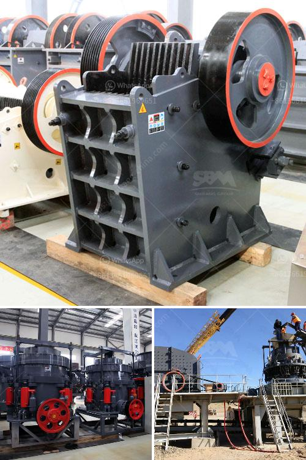

<h3>china jaw crusher pe 150 250 in philippines</h3>
China is one of the most well-known countries in the world for manufacturing heavy industrial machinery and equipment. Jaw crusher PE 150 250 in China has always been one of the indispensable mining equipment. For various stone materials crushing, its performance has reached the leading level in the international market. Other jaw crushers, such as PE 250×400, PE 200×350, etc., are also suitable for the crushing of materials with different hardness levels.

The PE 150 250 jaw crusher is a small jaw crusher with a production capacity of 1-3 tons per hour. It can crush various materials of medium hardness such as: pebbles, limestone, granite, basalt, quartz stone, etc. It is a small jaw crusher with numerous functions, such as crushing and shaping. Compared to the traditional fixed jaw crushers, the PE 150 250 jaw crusher has the advantages of low investment cost, lightweight, convenient operation, etc.

In recent years, China's heavy machinery and equipment market has been developing rapidly. The small jaw crusher has been favored by foreign users because of its small size and easy transportation. The jaw crusher PE 150 250 is designed with a simple structure, which makes it easier to operate and maintain. Compared with other common jaw crushers, it also has the advantage of low noise and less dust generation.

Firstly, the PE 150 250 jaw crusher adopts a deep crushing cavity. It has a large crushing ratio, uniform particle size, simple structure, reliable work, easy maintenance, and low operating cost. Secondly, the PE 150 250 jaw crusher is widely used in various industries, such as mining, smelting, building materials, highways, railways, water conservancy, chemical industry, etc. In addition, the PE 150 250 jaw crusher in Philippines is compact in structure, easy to install, and maintain.

In terms of price, the PE 150 250 jaw crusher is more cost-effective than other common models. The small output size and low price make it very suitable for small-scale mining investments. The PE 150 250 jaw crusher is small in size, easy to move, and transport, and can be freely matched with various equipment, making it more popular in the Philippines.

Due to the excellent performance of the PE 150 250 jaw crusher, many manufacturers in China have produced a wide range of styles and models, suitable for different applications. Additionally, China's jaw crusher manufacturers have explored overseas markets and exported jaw crushers to the Philippines and other countries, deeply recognized and welcomed by foreign customers.

In conclusion, the China jaw crusher PE 150 250 in Philippines plays an important role in the mining industry and construction industry. Jaw crusher is a kind of stone crusher that divides materials into medium-sized and fine-sized. The purpose of the jaw crusher machine is to crush the materials into smaller particles while ensuring the particle size is appropriate. In the process of crushing, it forms a multi-stage crushing, which improves the crushing efficiency and reduces the investment cost. As a professional jaw crusher manufacturer, China will continue to explore new technologies and improve product quality, providing customers with more efficient, energy-saving, and environmentally friendly mining equipment.
<h3>Contact us</h3><ul><li><strong>Whatsapp:&nbsp;<a href="https://wa.me/8613661969651">+8613661969651</a></strong></li><li><a href="https://swt.shibang-china.com/?git&amp;zhl&amp;china jaw crusher pe 150 250 in philippines"><strong>Online Service(chat now)</strong></a></li></ul><h3>Related</h3><ul><li><a href='quartz beneficiation.md'>quartz beneficiation</a></li><li><a href='granite crusher south africa.md'>granite crusher south africa</a></li><li><a href='iron ore dry grinding systems.md'>iron ore dry grinding systems</a></li><li><a href='equipments used in coal mining.md'>equipments used in coal mining</a></li><li><a href='mobile mineral processing gravity plants.md'>mobile mineral processing gravity plants</a></li></ul>