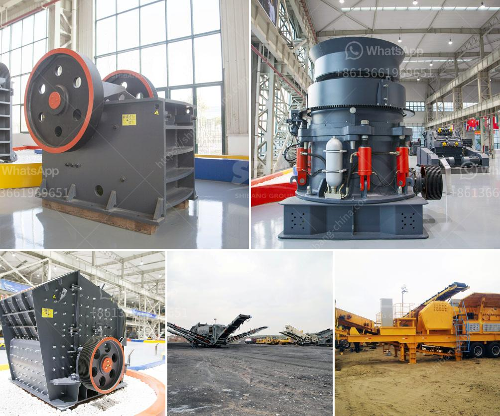

<h3>china shanghai zenith company</h3>
China Shanghai Zenith Company is a professional manufacturer of large-scale mining equipment, crusher, grinding mill, and other mining machinery. The company has been providing high-quality mining machinery and equipment for customers around the world for more than 30 years. It has an excellent reputation in the mining equipment industry and is well-known both domestically and internationally.

Shanghai Zenith Company has its headquarters located in Pudong New Area, Shanghai, China. The company covers a vast land area of over 66,000 square meters, making it one of the leading manufacturers in the industry. It has a strong production capacity, which enables it to efficiently produce and deliver its products to customers worldwide.

The company specializes in the production and sales of various types of mining equipment, including crushers, grinding mills, and sand making machines. These machines are used in mining, construction, metallurgy, and other industries, providing strong support for the development of these sectors. With advanced technology and innovative design, Shanghai Zenith Company continuously improves the performance and efficiency of its products, meeting the diverse needs of its customers.

The crushers produced by Shanghai Zenith Company are widely used in mining, construction, and various other industries. They are engineered for high crushing efficiency, reliable performance, and long service life. The company offers a wide range of crusher types, including jaw crushers, impact crushers, cone crushers, and hammer crushers. These crushers are designed to handle various materials, from hard rocks to soft stones, and from coarse crushing to fine crushing.

In addition to crushers, Shanghai Zenith Company also produces grinding mills and sand making machines. The grinding mills provided by the company include ball mills, Raymond mills, trapezium mills, SCM ultrafine mills, and vertical roller mills. These mills are used for grinding various ores and non-metallic minerals, ensuring excellent product fineness and energy efficiency.

The sand making machines manufactured by Shanghai Zenith Company are widely used in the production of manufactured sand and aggregates. These machines have high sand-making efficiency and low operation cost. They produce high-quality sand with excellent shape, meeting the strict requirements of the construction industry.

Shanghai Zenith Company has a professional technical team, which can provide customers with comprehensive pre-sales and after-sales services. The company's engineers have extensive experience in the industry and can provide customers with tailored solutions to meet their specific needs. The company also provides installation and debugging services to ensure the smooth operation of its machines.

With its high-quality products, excellent services, and strong technical support, Shanghai Zenith Company has gained a good reputation in the industry. Its products are exported to more than 120 countries and regions around the world, including Southeast Asia, Africa, South America, and Europe. The company adheres to the principle of "customer first" and strives to provide customers with the best mining equipment and services.

In conclusion, China Shanghai Zenith Company is a leading manufacturer of mining equipment, crusher, grinding mill, and sand making machines. It has a strong production capacity and provides customers with high-quality products and services. With its commitment to innovation and customer satisfaction, Shanghai Zenith Company continues to be a trusted partner in the mining industry.
<h3>Contact us</h3><ul><li><strong>Whatsapp:&nbsp;<a href="https://wa.me/8613661969651">+8613661969651</a></strong></li><li><a href="https://swt.shibang-china.com/?git&amp;zhl&amp;china shanghai zenith company"><strong>Online Service(chat now)</strong></a></li></ul><h3>Related</h3><ul><li><a href='stone crushers for sale china.md'>stone crushers for sale china</a></li><li><a href='mobile copper ore shaking table.md'>mobile copper ore shaking table</a></li><li><a href='quartz grinding unit sale in nigeria.md'>quartz grinding unit sale in nigeria</a></li><li><a href='roller crusher cad detail drawing.md'>roller crusher cad detail drawing</a></li><li><a href='barite crusher processing plant.md'>barite crusher processing plant</a></li></ul>