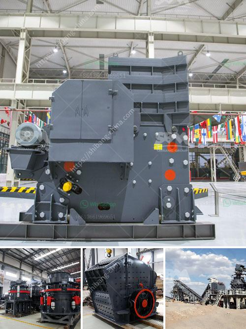

<h3>china talc processing factory rental ghana</h3>
Ghana, located in West Africa, is renowned for its vast mineral resources. These resources have attracted several multinational companies to invest in the mining sector. One such mineral, talc, has gained significant attention in recent years due to its diverse industrial applications. As a result, China, known for its expertise in talc processing, has established talc processing factory rentals in Ghana to cater to the local demand.

Talc, a magnesium silicate mineral, is primarily used in industries such as cosmetics, ceramics, paint, plastics, and paper. Its unique physical and chemical properties make it an essential ingredient in various manufacturing processes. The demand for talc in Ghana has skyrocketed due to its increasing use in the local manufacturing sector. However, the lack of local talc processing infrastructure has made it necessary for Ghanaian companies to seek external collaborations to meet their requirements.

China, being the leading producer of talc globally, has recognized the emerging market potential in Ghana. Chinese talc processing factories, equipped with advanced machinery and technical expertise, have capitalized on this opportunity by offering rental services to local companies. These factories provide a range of services, including mining, crushing, grinding, and packaging, to ensure the production of high-quality talc suitable for various applications.

The establishment of talc processing factories in Ghana has brought numerous benefits to the local economy. Firstly, it has created employment opportunities for Ghanaians, especially those living in the mining-rich regions. The operations of these factories require skilled and unskilled labor, thereby contributing to poverty alleviation and economic growth.

Secondly, the presence of Chinese talc processing factories has stimulated downstream industries in Ghana. Talc is used as a raw material in various manufacturing processes, and the availability of locally processed talc has significantly reduced production costs for local manufacturers. This, in turn, has made Ghanaian products more competitive both domestically and in the international market.

Furthermore, the collaboration between Ghanaian and Chinese companies has led to knowledge and technology transfer. Chinese factory managers and technicians work closely with their Ghanaian counterparts, sharing their expertise and experience in talc processing. This exchange has enhanced the skills and capabilities of local workers, promoting the development of a skilled workforce in the mining industry.

However, the rental of talc processing factories in Ghana does come with certain challenges. The cost of renting these facilities can be a burden for small and medium-sized enterprises, potentially limiting their access to talc processing services. Additionally, the reliance on external entities for talc processing exposes Ghana to potential fluctuations in rental costs and supply availability.

To address these challenges, it is crucial for the Ghanaian government and local companies to collaborate and invest in the development of local talc processing infrastructure. This would not only reduce dependence on external sources but also create a more sustainable and secure supply chain for talc.

In conclusion, the establishment of China talc processing factory rentals in Ghana has brought several benefits to the local economy. The collaboration between Ghanaian and Chinese companies has resulted in job creation, stimulated downstream industries, and facilitated knowledge transfer. However, to ensure the long-term growth of the talc industry, it is vital for Ghana to strengthen its domestic processing capabilities through strategic investments and partnerships.
<h3>Contact us</h3><ul><li><strong>Whatsapp:&nbsp;<a href="https://wa.me/8613661969651">+8613661969651</a></strong></li><li><a href="https://swt.shibang-china.com/?git&amp;zhl&amp;china talc processing factory rental ghana"><strong>Online Service(chat now)</strong></a></li></ul><h3>Related</h3><ul><li><a href='impact crusher philippines.md'>impact crusher philippines</a></li><li><a href='ykn vibrating screen manufacturer.md'>ykn vibrating screen manufacturer</a></li><li><a href='basalt production plant.md'>basalt production plant</a></li><li><a href='gravimetric centrifugal gold concentrator.md'>gravimetric centrifugal gold concentrator</a></li><li><a href='stone crushing plant use jaw crusher price list.md'>stone crushing plant use jaw crusher price list</a></li></ul>