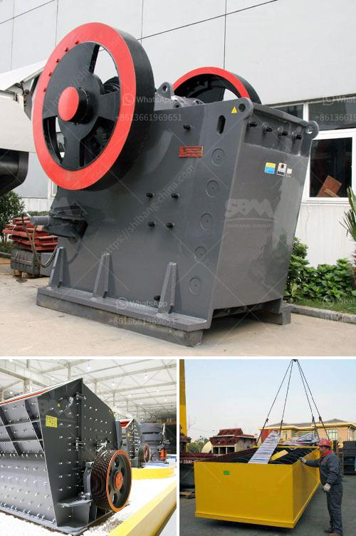

<h3>china vibrating screen</h3>
The vibrating screen is one of the most widely used screening machines in the mineral processing industry. It is mainly used to separate materials into different sizes for further processing. China, as one of the world's largest manufacturers of vibrating screens, has abundant resources and expertise in designing and manufacturing this equipment.

In China, vibrating screens are commonly used in industries such as coal, iron ore, steel, cement, and construction. The reasons why China's vibrating screens are so popular are mainly due to the following aspects:

1. Wide range of applications: China's vibrating screens are capable of handling a wide variety of materials, including minerals, sand, gravel, and chemicals. They can be used in various industries, ranging from mining and quarrying to building materials and chemical processing.

2. High screening efficiency: China's vibrating screens are designed to maximize the screening efficiency by utilizing the principles of physics. With proper design and optimization, these screens can effectively separate materials of different sizes, ensuring the highest possible screening efficiency.

3. Durable and reliable: China's vibrating screens are well-known for their excellent durability and reliability. The screens are typically made of high-quality materials, such as stainless steel or carbon steel, which can withstand the harsh working conditions in various industries.

4. Easy maintenance and operation: China's vibrating screens are designed with the end user in mind. They are equipped with user-friendly features, such as easy-to-replace screens and quick-access maintenance points, making them easy to operate and maintain.

5. Cost-effective: Compared to vibrating screens from other countries, China's vibrating screens are often more cost-effective. China has a large manufacturing base, which allows for economies of scale, resulting in competitive pricing for vibrating screens.

In recent years, China's vibrating screens have also seen advancements in technology. For instance, some manufacturers have introduced vibrating screens with advanced features, such as adjustable amplitude and frequency, which can enhance the screening performance and adapt to different materials and operating conditions.

Moreover, China's vibrating screens are becoming more environmentally friendly. Some manufacturers are developing screens with energy-efficient motors and noise-reducing design to minimize energy consumption and noise pollution. These eco-friendly features not only benefit the environment but also reduce operational costs for users.

In conclusion, China's vibrating screens have gained international recognition for their wide range of applications, high screening efficiency, durability, easy maintenance, and cost-effectiveness. With continuous advancements in technology and a focus on environmental sustainability, China's vibrating screens are expected to maintain their dominance in the global market.
<h3>Contact us</h3><ul><li><strong>Whatsapp:&nbsp;<a href="https://wa.me/8613661969651">+8613661969651</a></strong></li><li><a href="https://swt.shibang-china.com/?git&amp;zhl&amp;china vibrating screen"><strong>Online Service(chat now)</strong></a></li></ul><h3>Related</h3><ul><li><a href='complete stone quarry plant.md'>complete stone quarry plant</a></li><li><a href='price list coal crushing plant.md'>price list coal crushing plant</a></li><li><a href='talcum powder philling machine.md'>talcum powder philling machine</a></li><li><a href='amp gravel conveyor belt.md'>amp gravel conveyor belt</a></li><li><a href='feldspar crusher machine.md'>feldspar crusher machine</a></li></ul>