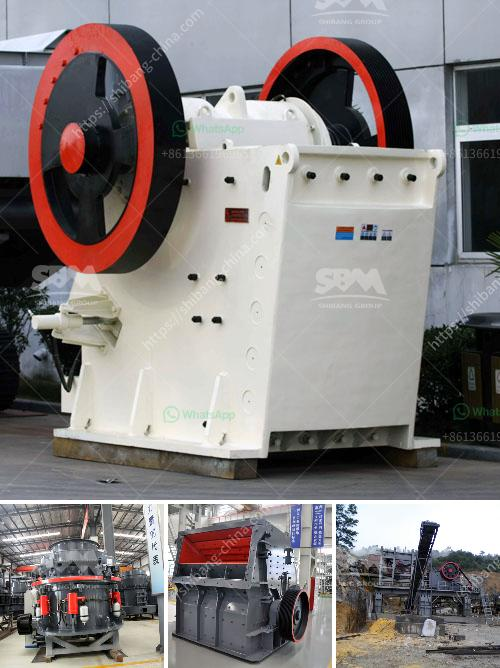

<h3>china wet ball mill</h3>
China is known for its efficient and innovative industrial processes. One such process is the wet ball mill, which is an essential tool in the manufacturing industry. It is used to grind materials into a fine powder, allowing them to be utilized in various applications.

The wet ball mill is a type of grinder that is utilized for grinding materials into extremely fine powder for use in mineral dressing processes, paints, pyrotechnics, ceramics, and selective laser sintering. The ball mill can grind various ores and other materials either wet or dry. It is suitable for both batch and continuous operation.

One of the significant advantages of wet ball mills is their ability to produce a product size closer to the desired size compared to dry grinding. This is achieved by the presence of a liquid medium in the cylindrical shell of the mill. The liquid reduces the amount of fines generated during the grinding process, resulting in a more efficient operation.

Moreover, the wet grinding process is known for its superior energy efficiency. Compared to dry grinding, wet grinding requires less energy input to achieve the same grinding result. This makes wet ball mills a more economical option, especially for large-scale industrial operations.

In addition to energy efficiency, wet ball mills offer several other benefits. They are generally easier to operate and maintain compared to dry ball mills. The liquid medium helps reduce the wear and tear on the mill components, increasing their lifespan and reducing the overall maintenance requirements.

China has been at the forefront of wet ball mill technology, continuously improving the design and performance of these machines. Chinese manufacturers have developed advanced techniques to enhance the efficiency and reliability of wet ball mills, making them an essential piece of equipment in various industries.

The use of wet ball mills in China is prevalent in industries such as mining, construction materials, metallurgy, chemical engineering, and pharmaceuticals. These industries rely on the wet grinding process to produce high-quality products that meet strict specifications.

China's commitment to research and development has led to the introduction of advanced features in wet ball mills. For instance, some models offer automated controls and monitoring systems, allowing operators to have better control over the process variables. This leads to improved process stability and product consistency.

Furthermore, Chinese manufacturers have also focused on environmental sustainability while designing wet ball mills. These machines are equipped with dust collection systems to minimize the emission of fine particles into the atmosphere. This not only improves the working environment but also ensures compliance with stringent environmental regulations.

In conclusion, the wet ball mill is an indispensable piece of equipment in China's manufacturing industry. Its ability to grind materials into fine powder efficiently and economically has made it a preferred choice for many industries. The continuous research and development efforts by Chinese manufacturers have led to the introduction of advanced features, enhancing the efficiency, reliability, and sustainability of wet ball mills. With China's growing influence in the global market, the wet ball mill is bound to remain an essential tool in industrial processes worldwide.
<h3>Contact us</h3><ul><li><strong>Whatsapp:&nbsp;<a href="https://wa.me/8613661969651">+8613661969651</a></strong></li><li><a href="https://swt.shibang-china.com/?git&amp;zhl&amp;china wet ball mill"><strong>Online Service(chat now)</strong></a></li></ul><h3>Related</h3><ul><li><a href='amp gravel conveyor belt.md'>amp gravel conveyor belt</a></li><li><a href='conveyor belts company.md'>conveyor belts company</a></li><li><a href='how much is a gold crusher in kenya.md'>how much is a gold crusher in kenya</a></li><li><a href='business plan for small mining processing plant.md'>business plan for small mining processing plant</a></li><li><a href='looking for washing plant for gold germany.md'>looking for washing plant for gold germany</a></li></ul>