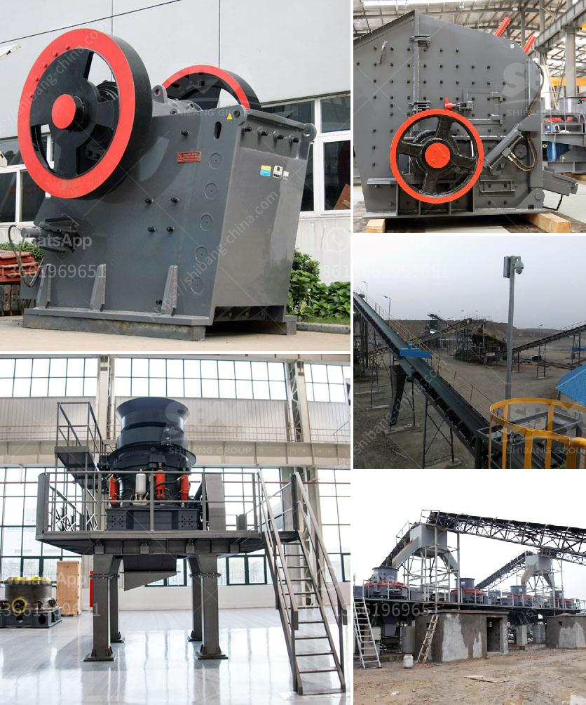

<h3>chrome mining equipment for sale in south africa</h3>
Chrome mining in South Africa is a thriving industry that contributes significantly to the country's economy and supports over 82,000 jobs nationwide. The industry not only brings financial benefits to the country but also provides employment opportunities to a large number of people.

The chrome mining industry in South Africa is well-established and constantly evolving, with new technologies and equipment being developed and utilized on a daily basis. Chrome mining equipment is specifically built for the demanding environment of the mining industry. These rugged machines can withstand harsh conditions and intense workloads, ensuring optimal performance and minimal downtime.

When it comes to chrome mining equipment for sale in South Africa, one must understand that these machines come in different shapes and sizes, suitable for various applications. These machines include large-scale equipment like underground mining loaders, massive trucks capable of hauling large quantities of chrome ore, and specialized drilling equipment to reach deeper deposits.

Underground mining loaders are essential pieces of equipment used to extract chrome ore from the underground tunnels. These robust machines are capable of carrying heavy loads and navigating through tight spaces. They feature advanced safety features and improved efficiency, enhancing productivity and reducing risks in the mining process.

Massive trucks are another vital component of the chrome mining industry. These trucks are designed to transport large quantities of chrome ore from the mining site to storage facilities or processing plants. Equipped with powerful engines, robust suspensions, and durable bodies, these trucks can handle rough terrains and challenging environments.

Chrome mining also requires specialized drilling equipment to reach the chrome ore deposits beneath the surface. These drilling rigs are designed to efficiently penetrate hard rock formations, ensuring accurate and precise extraction of chrome ore. They are equipped with advanced drilling systems that optimize drilling speed, reduce downtime, and enhance productivity.

Furthermore, the chrome mining industry in South Africa also utilizes various support equipment to facilitate the mining process. These include powerful generators for providing electricity to the mining site, pumps for water management, and cutting-edge monitoring systems to ensure workplace safety and productivity.

Chrome mining equipment for sale in South Africa is widely available. Major mining equipment manufacturers provide suitable machines and support for the industry's operations. With the increasing demand for chrome ore globally, more mines are expected to be established, further driving the growth of the chrome mining equipment market in South Africa.

In conclusion, the chrome mining industry in South Africa plays a crucial role in the country's economy and employment sector. The availability of various chrome mining equipment further enhances the industry's growth and productivity. Robust machines designed specifically for chrome mining can withstand tough conditions and optimize the mining process. As the demand for chrome ore continues to rise, the market for chrome mining equipment is expected to expand, supporting economic growth and job creation in South Africa.
<h3>Contact us</h3><ul><li><strong>Whatsapp:&nbsp;<a href="https://wa.me/8613661969651">+8613661969651</a></strong></li><li><a href="https://swt.shibang-china.com/?git&amp;zhl&amp;chrome mining equipment for sale in south africa"><strong>Online Service(chat now)</strong></a></li></ul><h3>Related</h3><ul><li><a href='grinding mills for sale johannesburg.md'>grinding mills for sale johannesburg</a></li><li><a href='rock crushers prices.md'>rock crushers prices</a></li><li><a href='ball grinding machine in india.md'>ball grinding machine in india</a></li><li><a href='vsi crusher manufacturers.md'>vsi crusher manufacturers</a></li><li><a href='450 tph limestone crusher.md'>450 tph limestone crusher</a></li></ul>