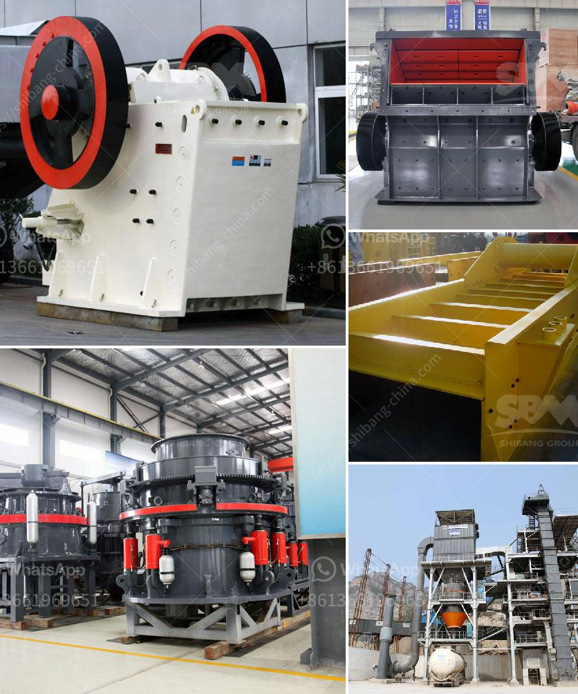

<h3>chrome ore washing plant</h3>
Chrome ore washing plant is a professional manufacturer of chrome beneficiation equipment. It mainly includes spiral chute, spiral classifier, jigging machine, shaking table, centrifugal concentrator and spiral concentrator. Chrome ore beneficiation process is to separate chrome ore in different particle size and grade according to the specific gravity of the chromite ore, and the chrome ore washing plant uses the method of gravity separation to wash away the dirt and mud on the surface of the ore and separate them. This process not only improves the grade of chrome ore but also reduces the pollution to the environment.

The chrome ore washing plant has a large processing capacity and a wide range of particle size. According to the concentration of chromium ore, it can be divided into pre-concentration, concentration, and dewatering. The pre-concentration is mainly gravity separation, and the equipment used includes spiral chute, spiral classifier, and jigging machine. The concentration process mainly uses shaking table, centrifugal concentrator, and spiral concentrator. The dewatering process uses a dewatering screen to dehydrate the chrome concentrate and obtain separate chrome ore.

Chrome ore washing plant has the advantages of large processing capacity and high recovery rate. It can effectively remove harmful elements in the chrome ore, and also improve the quality and grade of the chrome concentrate. At the same time, it has less investment, low energy consumption, and convenient operation. It is suitable for the separation and washing of chrome ore in large-scale chrome ore beneficiation plants.

In summary, the chrome ore washing plant is an important equipment in the chrome ore beneficiation process. It not only improves the grade of chrome ore but also reduces the pollution caused by waste. It is an ideal choice for chrome ore processing. With the continuous improvement of beneficiation technology, the chrome ore washing plant will bring more economic benefits to chrome ore processing enterprises.
<h3>Contact us</h3><ul><li><strong>Whatsapp:&nbsp;<a href="https://wa.me/8613661969651">+8613661969651</a></strong></li><li><a href="https://swt.shibang-china.com/?git&amp;zhl&amp;chrome ore washing plant"><strong>Online Service(chat now)</strong></a></li></ul><h3>Related</h3><ul><li><a href='sand conveyors for rent.md'>sand conveyors for rent</a></li><li><a href='limestone crushers for chicken feed production.md'>limestone crushers for chicken feed production</a></li><li><a href='to separate manganese and iron ore.md'>to separate manganese and iron ore</a></li><li><a href='granite machine concrete.md'>granite machine concrete</a></li><li><a href='china gold dry washer manufacturer in philippines.md'>china gold dry washer manufacturer in philippines</a></li></ul>