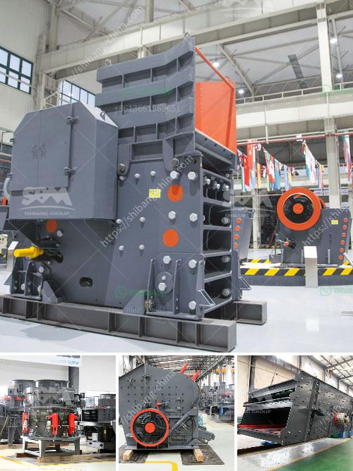

<h3>chrome processing and drying</h3>
Chrome processing and drying play crucial roles in various industries, particularly in the manufacturing and production of high-quality goods. The process involves multiple steps and requires careful attention to detail to ensure optimal results. In this article, we will delve into the chrome processing and drying process, highlighting its significance and providing a detailed overview of its steps.

Chrome processing is a method used to achieve a durable, corrosion-resistant coating on various materials, including metal, plastic, and wood. The primary purpose of chrome processing is to enhance the aesthetic appeal of the object while providing it with added strength and protection against wear and tear. Chrome plating gives the material a glossy, mirror-like finish, making it highly sought after in industries such as automotive, aerospace, and household appliance manufacturing.

The chrome processing and drying process can be broken down into several phases. The initial step involves surface preparation, where the material to be chromed is thoroughly cleaned and any existing coatings, corrosion, or imperfections are removed. This is typically done through a combination of chemical cleaners, abrasive blasting, and polishing. It is crucial to ensure a clean and smooth surface to achieve a high-quality chrome finish.

Once the surface preparation is complete, the material is immersed in a series of chemical baths. The first bath usually consists of a degreasing solution to remove any remaining contaminants. It is followed by an acid bath to etch the surface, creating a rough texture that allows the subsequent layers of chrome to adhere effectively. After the acid bath, the material undergoes multiple rinses to remove any traces of chemicals.

The next phase is the deposition of a thin layer of copper. A copper bath is used to create a smooth and uniform layer on the surface, preventing any potential pinholes or imperfections in the final chrome layer. The part is carefully suspended into the bath, and an electrical current is passed through it to facilitate the deposition of copper ions onto the surface. After copper plating, another rinsing process is carried out to eliminate any excess copper.

Following the copper deposition, the material is ready for the chrome plating stage. The part is submerged into a bath containing a mixture of chromic acid and sulfate, along with various additives to control the plating process. The bath is maintained at a specific temperature and pH level to ensure optimal plating. As an electric current is applied, chrome ions are attracted to the material's surface, forming a layer of chromium metal. This layer provides excellent corrosion resistance, hardness, and the characteristic shiny appearance associated with chrome finishes.

Once the desired thickness of the chrome layer is achieved, the final step is drying. Drying is a critical process in chrome processing, as any retained moisture can lead to defects and affect the overall quality of the finish. After being removed from the plating bath, the parts are thoroughly rinsed with deionized water to remove any residual chemicals. They are then carefully dried using specialized equipment, such as forced air dryers, ovens, or blowers. The drying process ensures that the chrome coating is completely dry, preventing any oxidation or corrosion from occurring.

In conclusion, chrome processing and drying are vital steps in achieving high-quality finishes and enhancing the durability of various materials. The process involves surface preparation, copper deposition, chrome plating, and careful drying to ensure a flawless final product. Chrome finishes are widely used across numerous industries due to their aesthetic appeal and corrosion resistance. By understanding the intricacies of chrome processing and drying, manufacturers can ensure the production of top-notch, long-lasting goods.
<h3>Contact us</h3><ul><li><strong>Whatsapp:&nbsp;<a href="https://wa.me/8613661969651">+8613661969651</a></strong></li><li><a href="https://swt.shibang-china.com/?git&amp;zhl&amp;chrome processing and drying"><strong>Online Service(chat now)</strong></a></li></ul><h3>Related</h3><ul><li><a href='price of mobile stone crusher.md'>price of mobile stone crusher</a></li><li><a href='vertical grinding machine black and dacker.md'>vertical grinding machine black and dacker</a></li><li><a href='talc raymond grinding mill.md'>talc raymond grinding mill</a></li><li><a href='small stone crusher machine.md'>small stone crusher machine</a></li><li><a href='prices for stone crusher plant.md'>prices for stone crusher plant</a></li></ul>