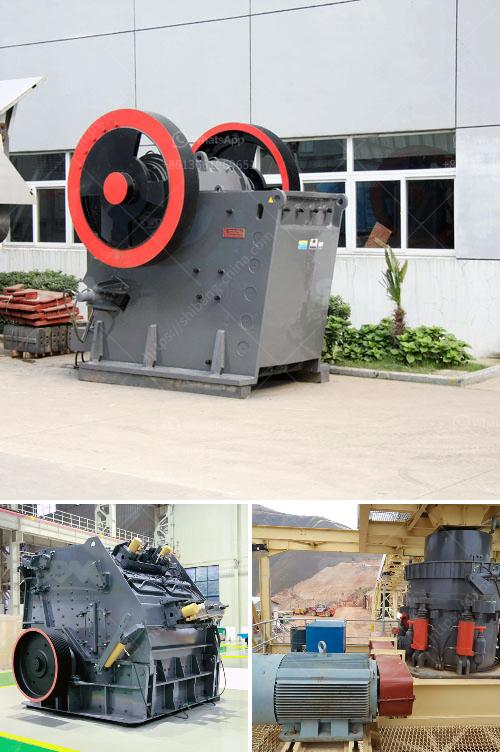

<h3>cinder block crushing machines for rent</h3>
Cinder blocks or concrete blocks are building materials made from a mixture of cement, sand, gravel, and water. They are widely used in the construction industry for building walls, foundations, and other structures. However, at some point, these cinder blocks may need to be crushed to reduce their size for easy disposal or recycling.

Cinder block crushing machines are widely used in various construction sites to crush cinder blocks into smaller pieces. These machines come in different sizes and specifications to meet the diverse crushing needs of various construction projects. Whether you need a larger machine for a large-scale construction project or a smaller one for a DIY project at home, there are cinder block crushing machines available for rent.

Renting cinder block crushing machines can save you time and money on your construction project. Instead of purchasing a costly machine that you may only need for a short period, renting allows you to use the machine for the specific duration of your project. This eliminates the need for long-term storage and maintenance costs associated with owning and storing heavy machinery.

Renting a cinder block crushing machine also provides flexibility and convenience. You can easily find a rental company near your construction site, saving you time and transportation costs. Additionally, most rental companies offer a wide range of crushing machines, allowing you to choose the one that best suits your project requirements. Whether you need a machine with high crushing capacity or a machine that is easily maneuverable in tight spaces, rental companies can provide options to meet your specific needs.

Moreover, renting a cinder block crushing machine ensures that you have access to modern and well-maintained equipment. Rental companies regularly maintain their machines, ensuring optimal performance and reducing downtime on your project. This saves you from the hassle of maintenance and repair, minimizing any delays in your construction schedule.

Furthermore, using a cinder block crushing machine has environmental benefits. Crushing cinder blocks allows for efficient recycling of materials. The crushed blocks can be reused as aggregate in new concrete or other construction applications, reducing the need for new raw materials. This promotes sustainability and contributes to a circular economy by reducing waste and conserving resources.

In conclusion, renting cinder block crushing machines can be a cost-effective and convenient solution for construction projects that require crushing cinder blocks. By opting to rent, you can save money, time, and storage costs associated with owning heavy machinery. Rental companies offer a wide range of machines, ensuring that you can find the right one for your project requirements. Additionally, renting provides access to modern and well-maintained equipment, minimizing downtime and maintenance efforts. Finally, crushing cinder blocks promotes sustainability by enabling efficient recycling of materials. So, whether it's a large-scale construction project or a DIY endeavor, consider renting a cinder block crushing machine for your crushing needs.
<h3>Contact us</h3><ul><li><strong>Whatsapp:&nbsp;<a href="https://wa.me/8613661969651">+8613661969651</a></strong></li><li><a href="https://swt.shibang-china.com/?git&amp;zhl&amp;cinder block crushing machines for rent"><strong>Online Service(chat now)</strong></a></li></ul><h3>Related</h3><ul><li><a href='portable rock crusher.md'>portable rock crusher</a></li><li><a href='125 hp cone crusher.md'>125 hp cone crusher</a></li><li><a href='rubble recycling machine in china.md'>rubble recycling machine in china</a></li><li><a href='stone mill grinder for sale.md'>stone mill grinder for sale</a></li><li><a href='roller mill pulverizer ofto 5 tons per hour price.md'>roller mill pulverizer ofto 5 tons per hour price</a></li></ul>