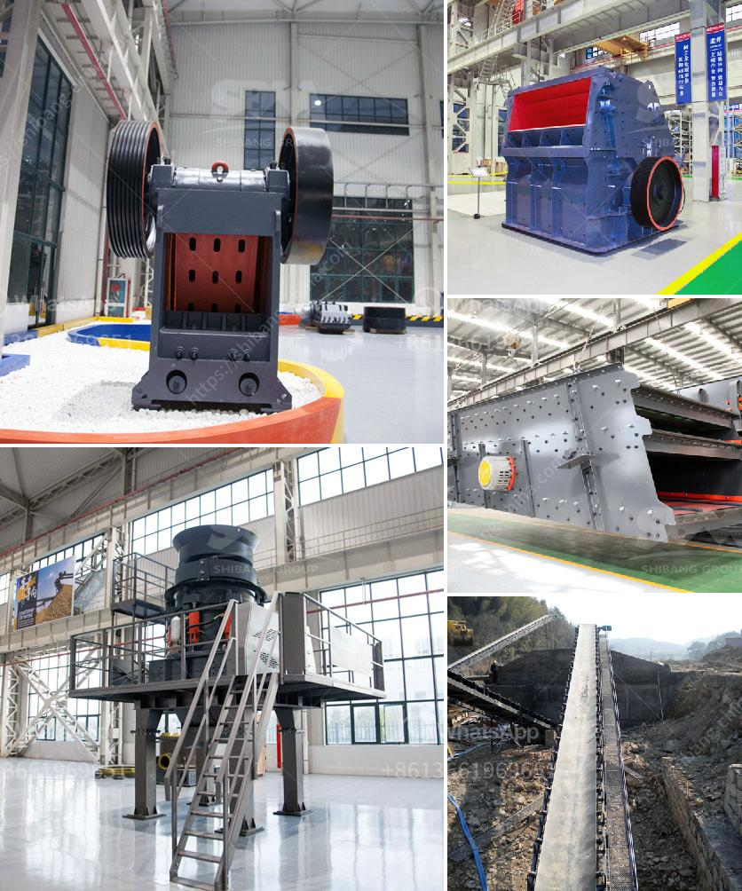

<h3>clay ball mill machine browns</h3>
Ceramic materials have been an integral part of human civilization for centuries. From ancient pottery pieces to modern electronics, ceramics have found their way into various industries. One crucial aspect of ceramic processing is the use of ball mills.

The ball mill is a machine used to grind and mix different materials, especially minerals. It works on the principle of impact and attrition: the size reduction occurs when the particles collide against the cylindrical shell and the grinding medium (balls or rods).

Among the various types of ball mills available in the market, the clay ball mill machine is undoubtedly the most common and efficient. Its use ensures that clay can be processed into a consistent and high-quality material used in various industries.

The machine's design is based on the principle of the planetary motion, where the grinding jars are installed on a rotating disk. The jars themselves rotate in a circular motion, causing the balls within them to tumble and grind the clay into a fine powder.

One significant advantage of using a clay ball mill machine is its ability to blend clay with other materials. With the addition of water, binders, and other substances, clay can be transformed into a slurry that can be molded, dried, and fired into various ceramic products.

In the ceramic industry, clay ball mills are used to produce ceramics tiles. These tiles are fashioned by molding the clay into the desired shape and size and then firing them at high temperatures. The ball mill machine ensures that the ceramic tiles have a uniform structure and consistent color.

The pharmaceutical industry also benefits from the clay ball mill machine. Ball mills are used to grind medicinal powders into fine particles, ensuring the proper dissolution and efficacy of drugs. The finely ground powder allows for faster absorption and higher bioavailability of the active ingredients.

Clay ball mills are also extensively used in the construction industry. The clay, when mixed with cement and sand, creates what is known as adobe bricks. These bricks are widely used in the construction of houses and buildings in regions where clay is abundant. The ball mill machine grinds the clay, thus improving its workability and making it easier to produce adobe bricks in large quantities.

The versatility and efficiency of clay ball mill machines have made them a standard tool in the ceramics and construction industries. With their use, clay can be processed into various forms and products, offering countless possibilities for creative design and functional applications.

In summary, the clay ball mill machine plays a crucial role in ceramic processing by grinding and blending clay with other materials. Its ability to produce uniform and high-quality ceramic products has made it an indispensable tool in various industries. From ceramics tiles to pharmaceutical drugs and adobe bricks, the clay ball mill machine has empowered manufacturers to create exceptional products that shape our world.
<h3>Contact us</h3><ul><li><strong>Whatsapp:&nbsp;<a href="https://wa.me/8613661969651">+8613661969651</a></strong></li><li><a href="https://swt.shibang-china.com/?git&amp;zhl&amp;clay ball mill machine browns"><strong>Online Service(chat now)</strong></a></li></ul><h3>Related</h3><ul><li><a href='febcoal coal mining plant in ethiopia.md'>febcoal coal mining plant in ethiopia</a></li><li><a href='hard rock crusher.md'>hard rock crusher</a></li><li><a href='modular mineral processing plant.md'>modular mineral processing plant</a></li><li><a href='hammer mill sales kenya.md'>hammer mill sales kenya</a></li><li><a href='production line chrome ore concentration plant mar.md'>production line chrome ore concentration plant mar</a></li></ul>