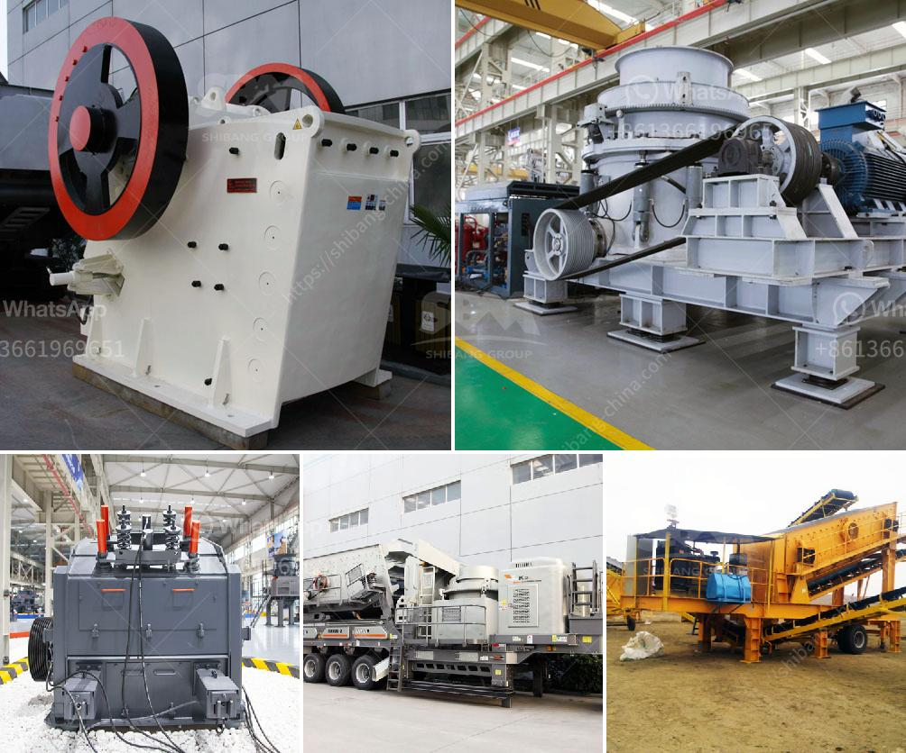

<h3>clay brick making machine zimbabwe</h3>
Clay brick making machines have been an integral part of the construction industry for centuries. With the advancement in technology, these machines have become more efficient and easier to operate, making brick production faster and more cost-effective. In Zimbabwe, clay brick making machines are gaining popularity due to their ability to produce high-quality bricks using locally available materials.

One of the main advantages of using a clay brick making machine in Zimbabwe is that it eliminates the need for extensive manual labor. Traditionally, brick making involved a manual process of mixing clay, molding the bricks, and drying them in the sun. This process was labor-intensive and time-consuming. However, with the use of a brick making machine, the entire process is automated, reducing the need for manual labor and increasing productivity.

Another benefit of using a clay brick making machine in Zimbabwe is the ability to produce bricks of consistent quality. These machines are designed to mix the clay thoroughly and evenly, resulting in bricks with uniform size and strength. This consistency is crucial in construction projects as it ensures the structural integrity of buildings.

Additionally, using a clay brick making machine allows for the customization of bricks. The machines can be adjusted to produce bricks of different shapes, sizes, and colors, depending on the requirements of the project. This versatility is beneficial for architects and builders who aim to create unique designs and patterns.

Furthermore, the use of clay brick making machines promotes sustainability in the construction industry. These machines use locally available clay as a raw material, reducing the need for transportation and minimizing the carbon footprint. Additionally, the bricks produced by these machines are durable and long-lasting, reducing the need for frequent rebuilding or repairs.

In conclusion, clay brick making machines are revolutionizing the construction industry in Zimbabwe. They offer numerous benefits such as increased productivity, consistent quality, customization options, and sustainability. As the demand for affordable housing and infrastructure development continues to rise in Zimbabwe, the use of these machines is expected to grow, providing a viable solution to meet the country's construction needs.
<h3>Contact us</h3><ul><li><strong>Whatsapp:&nbsp;<a href="https://wa.me/8613661969651">+8613661969651</a></strong></li><li><a href="https://swt.shibang-china.com/?git&amp;zhl&amp;clay brick making machine zimbabwe"><strong>Online Service(chat now)</strong></a></li></ul><h3>Related</h3><ul><li><a href='basalt crushing production line.md'>basalt crushing production line</a></li><li><a href='material vibrator feeder.md'>material vibrator feeder</a></li><li><a href='propel mobile crusher.md'>propel mobile crusher</a></li><li><a href='granite crusher manufacturer.md'>granite crusher manufacturer</a></li><li><a href='mobile coal crusher in philippines.md'>mobile coal crusher in philippines</a></li></ul>