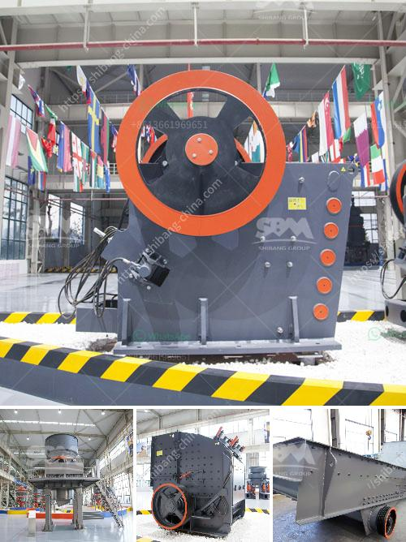

<h3>clay ceromic manufacturing process</h3>
Clay ceramics, also known as pottery, have been an integral part of human civilization for thousands of years. The process of manufacturing clay ceramics involves various stages, from sourcing the clay to shaping, firing, and glazing, resulting in beautiful and functional pieces of art. Let's explore this fascinating process, step by step.

The first step in clay ceramics manufacturing is sourcing the clay. The type of clay used can greatly affect the final product. Clay can be obtained from various locations, such as riverbeds, quarries, or even lakes. It is crucial to select clay with the right composition and texture to ensure optimal results. The clay is then dug up and carefully screened to remove any impurities like rocks, twigs, or leaves.

Once the clay has been sourced, it is time to prepare it for shaping. The clay is mixed with water and immersed in a large container, known as a clay mixer or pug mill. This process, called wedging, removes any air bubbles and ensures a uniform consistency throughout the clay body. This malleable clay is then ready to be shaped into various forms.

Shaping the clay is the most visually appealing stage of the manufacturing process. Potters use a variety of techniques, including throwing on a pottery wheel, hand-building, or using molds to create clay vessels or sculptures. Each technique requires precision and skill as the artist manipulates the soft clay into the desired shape.

Once the initial shaping is complete, the clay pieces need to be dried. This stage is crucial as it helps remove any remaining moisture, making the clay more resilient during the firing process. The drying process may take several days to weeks, depending on the size and thickness of the clay objects. It is vital to ensure a slow and even drying process to prevent cracking or warping.

After the drying stage, the clay pieces are ready for the first firing, known as bisque firing. Bisque firing transforms the clay into a hard, durable substance that can withstand higher temperatures. The pieces are loaded into a kiln and heated to temperatures ranging from around 1500 to 2000 degrees Fahrenheit, depending on the type of clay used. This firing process removes any remaining organic materials and ensures the longevity and structural integrity of the ceramics.

Once the bisque firing is complete, the clay ceramics undergo glazing, which enhances their aesthetic appeal and adds a protective layer. Glazes, which consist of various minerals and oxides, are carefully applied to the bisque-fired ceramics, either by dipping, brushing, or spraying. The pieces are then fired once again in the kiln at a higher temperature, typically between 1800 and 2200 degrees Fahrenheit, depending on the glaze used. This final firing vitrifies the glaze, resulting in a glossy, smooth finish.

The entire clay ceramics manufacturing process requires both technical precision and artistic creativity. From selecting the right clay to shaping, drying, and firing, each step contributes to the final masterpiece. Whether it's a functional mug or a decorative vase, clay ceramic pieces enchant us with their timeless beauty, reminding us of the rich history and craftsmanship behind each creation.
<h3>Contact us</h3><ul><li><strong>Whatsapp:&nbsp;<a href="https://wa.me/8613661969651">+8613661969651</a></strong></li><li><a href="https://swt.shibang-china.com/?git&amp;zhl&amp;clay ceromic manufacturing process"><strong>Online Service(chat now)</strong></a></li></ul><h3>Related</h3><ul><li><a href='rock pulverizer crusher technologies.md'>rock pulverizer crusher technologies</a></li><li><a href='trapezium mill south africa.md'>trapezium mill south africa</a></li><li><a href='cheap used jaw rock crushers for sale.md'>cheap used jaw rock crushers for sale</a></li><li><a href='hydraulic cone crusher price.md'>hydraulic cone crusher price</a></li><li><a href='limestone price in pakistan.md'>limestone price in pakistan</a></li></ul>