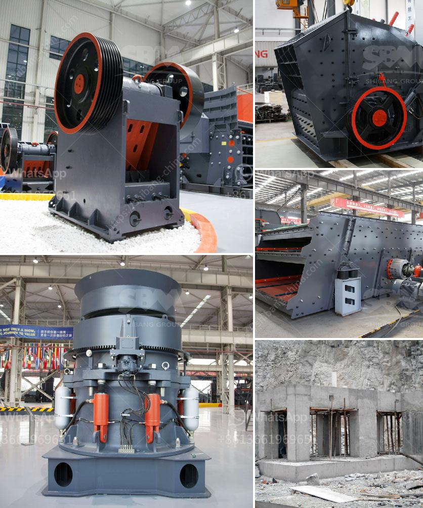

<h3>clay graphite grinding process</h3>
Clay graphite grinding process is often used in the manufacturing of ceramics, refractories, and other industrial products that require a high degree of hardness and strength. The grinding process involves preparing the clay graphite mixture for forming, shaping, or firing by pulverizing it into a fine powder.

The first step in the clay graphite grinding process is to obtain the raw materials. Clay and graphite are usually sourced separately and then mixed together in a precise ratio. The clay provides plasticity and binding properties, while the graphite adds strength and heat resistance. The quality and composition of the raw materials play a crucial role in determining the final properties of the product.

Once the raw materials are prepared, they are placed in a grinding mill. The grinding mill can be either a ball mill, a roller mill, or a vertical mill. The different types of grinding mills have different working principles and are designed for different purposes. However, they all aim to crush and grind the clay graphite mixture into a fine powder.

During the grinding process, the clay graphite mixture is subjected to various forces such as impact, shear, friction, and compression. These forces break down the larger particles into smaller particles, resulting in a finer and more uniform powder. The grinding process also helps to remove impurities and air bubbles that may be present in the mixture.

After the grinding process is complete, the fine powder is ready for the next stage of processing. Depending on the desired product, the powder can be used for forming, shaping, or firing. In the forming stage, the powder may be mixed with water or other additives to create a plastic mass that can be molded into various shapes. In the shaping stage, the powder can be pressed into molds or extruded through dies to create specific shapes. In the firing stage, the shaped products are heated at high temperatures to remove any remaining moisture and to induce chemical and physical changes that strengthen the material.

In conclusion, the clay graphite grinding process is an essential step in the manufacturing of ceramics, refractories, and other industrial products. By pulverizing the raw materials into a fine powder, the grinding process enhances the properties and performance of the final products.
<h3>Contact us</h3><ul><li><strong>Whatsapp:&nbsp;<a href="https://wa.me/8613661969651">+8613661969651</a></strong></li><li><a href="https://swt.shibang-china.com/?git&amp;zhl&amp;clay graphite grinding process"><strong>Online Service(chat now)</strong></a></li></ul><h3>Related</h3><ul><li><a href='advantages of hammer mill.md'>advantages of hammer mill</a></li><li><a href='500 ton hour coal crusher and screen.md'>500 ton hour coal crusher and screen</a></li><li><a href='aggregates crusher philippines.md'>aggregates crusher philippines</a></li><li><a href='ball mill capacity 10 tph in malaysia.md'>ball mill capacity 10 tph in malaysia</a></li><li><a href='mobile mineral processing gravity plants.md'>mobile mineral processing gravity plants</a></li></ul>