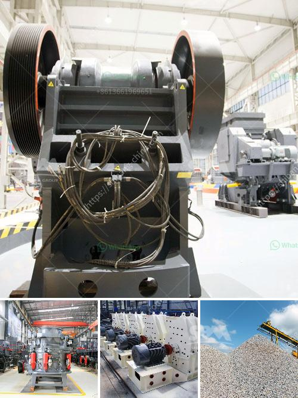

<h3>clay kaolin processing equipment</h3>
Kaolin, also known as china clay, is a white-colored clay that is extensively used in ceramics, paper, paint, rubber, and many other industries. It is a soft, earthy mineral that consists mainly of kaolinite, a hydrated aluminum silicate. In order to use kaolin efficiently and effectively in various applications, the clay needs to undergo processing through specialized equipment.

Processing kaolin involves several steps, each of which is essential to the quality of the final product. First, the raw kaolin ore needs to be crushed into smaller particles, so that it can be transported and ground more easily. This is typically done using jaw crushers, cone crushers, or hammer mills. After the crushing stage, the kaolin particles are then sent to a grinding mill, where they are ground to produce fine powder.

The next step in the kaolin processing is to remove impurities from the finely ground powder. These impurities can include minerals such as quartz, feldspar, and iron-bearing minerals, which can negatively affect the quality of the final product. This purification process is commonly done using magnetic separation or flotation techniques.

Once the kaolin has been purified, it undergoes further processing to improve its properties. One of the most common methods is called calcination, which involves heating the kaolin to a high temperature to remove chemically bonded water molecules and improve its brightness and whiteness. This process is typically done in a rotary kiln, where the kaolin is heated to temperatures around 1000°C. After calcination, the kaolin is cooled and then sent to a storage facility.

In addition to calcination, other processing techniques can be used to modify the properties of kaolin. For instance, delamination can be employed to enhance the aspect ratio and particle size of the kaolin platelets, making it more suitable for certain applications such as paints and coatings. Other treatments, such as bleaching or acid leaching, can be used to further refine the color and remove any remaining impurities.

To carry out these various processing steps efficiently, specialized equipment is required. Equipment such as crushers, grinders, classifiers, kilns, and mixing tanks are commonly used in kaolin processing. These machines are designed to handle the specific properties of kaolin and ensure the desired quality of the final product.

In conclusion, kaolin processing is a complex and important process that involves several steps to produce high-quality kaolin products. Through crushing, grinding, purification, and other treatments, kaolin can be refined to meet the specific requirements of different industries. The use of specialized equipment is crucial to ensure the efficiency and effectiveness of the processing. Kaolin processing equipment, such as crushers, grinders, classifiers, kilns, and mixing tanks, are essential tools for the successful processing of kaolin. With the right equipment, manufacturers can produce kaolin products effectively, meeting the demands of various industries and applications.
<h3>Contact us</h3><ul><li><strong>Whatsapp:&nbsp;<a href="https://wa.me/8613661969651">+8613661969651</a></strong></li><li><a href="https://swt.shibang-china.com/?git&amp;zhl&amp;clay kaolin processing equipment"><strong>Online Service(chat now)</strong></a></li></ul><h3>Related</h3><ul><li><a href='marble grinding machine price.md'>marble grinding machine price</a></li><li><a href='list of mineral processing plants in oman.md'>list of mineral processing plants in oman</a></li><li><a href='prices of stone crusher.md'>prices of stone crusher</a></li><li><a href='talc ball mills south africa.md'>talc ball mills south africa</a></li><li><a href='calcium carbonate powder mill price.md'>calcium carbonate powder mill price</a></li></ul>