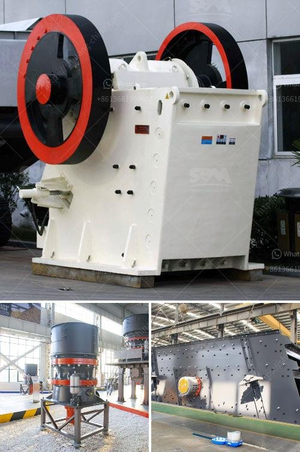

<h3>clay production process</h3>
Clay, a natural resource abundant in the Earth's crust, has been a material of choice for humans for thousands of years. Its versatility and malleability make it an essential element in various industries, including pottery, construction, and even healthcare. But have you ever wondered how clay transforms from a simple earthy substance into a functional object? Let's dive into the fascinating clay production process.

The first step in clay production begins with the extraction of clay from the earth's surface or beneath the ground. Clay deposits are typically found near riverbanks, hillsides, or areas with high moisture content. Excavators or backhoes are used to remove the topsoil, exposing the clay layer which is then extracted using industrial machinery or sometimes manually.

Once the clay is collected, it goes through a weathering process to improve its consistency and workability. The clay is spread out in a large, open field, allowing it to dry under the sun, rain, and wind for several weeks or even months. This natural weathering process aids in breaking down organic matter, removing impurities, and reducing the clay's size particles, resulting in a more refined and homogeneous material.

After weathering, the clay is crushed into smaller pieces to facilitate further processing. Large industrial crushers reduce the size of clay lumps into smaller fragments. The crushed clay is then fed into grinding machines, where it is ground into a fine powder. Grinding not only breaks down the clay particles into smaller sizes but also enhances its plasticity and makes it easier to mold.

At this stage, various types of clay may be blended together to achieve desired characteristics and properties. Different clays possess distinct attributes, such as color, plasticity, or firing temperature, and blending helps create a customized clay body with specific qualities suitable for different applications. Industrial mixers ensure a thorough and uniform blend of the different clay types.

The next step in the clay production process involves adding water to the clay powder to create a workable consistency. Water is gradually incorporated into the mix at controlled intervals while the clay is kneaded or mixed to achieve proper hydration. This water addition helps bind the clay particles, improving its plasticity and making it easier to manipulate.

Once the clay has reached the desired consistency, it is ready for shaping and forming. Potters and artisans use various techniques such as hand-building, wheel-throwing, or mold-casting to transform the clay into functional or decorative objects. The malleability of clay allows for intricate designs, making it an ideal medium for artistic creations.

After shaping, the formed clay object must be left to dry gradually. During the drying process, the excess moisture in the clay evaporates, causing it to shrink and harden. Proper drying is crucial to prevent cracking or warping when fired in a kiln. The drying time can range from several days to weeks, depending on the size and thickness of the object.

The final step in the clay production process is firing. Firing transforms the dried clay into a solid, durable object by subjecting it to high temperatures in a kiln. The temperature and duration of firing vary depending on the type of clay and the desired outcome. Firing removes any remaining moisture and chemically alters the clay to create a permanent structure.

The clay production process, from extraction to firing, showcases the remarkable journey of a humble natural material into functional or decorative objects. Each step in this process plays a crucial role in refining clay's properties and allowing it to fulfill its multitude of purposes. So, the next time you hold a ceramic mug or admire a pottery masterpiece, remember the intricate journey of clay that brought it to life.
<h3>Contact us</h3><ul><li><strong>Whatsapp:&nbsp;<a href="https://wa.me/8613661969651">+8613661969651</a></strong></li><li><a href="https://swt.shibang-china.com/?git&amp;zhl&amp;clay production process"><strong>Online Service(chat now)</strong></a></li></ul><h3>Related</h3><ul><li><a href='modular mineral processing plant.md'>modular mineral processing plant</a></li><li><a href='ball mill pictures.md'>ball mill pictures</a></li><li><a href='rock crushers in china.md'>rock crushers in china</a></li><li><a href='bauxite crusher plant construction.md'>bauxite crusher plant construction</a></li><li><a href='ultra fine dry grinding mill.md'>ultra fine dry grinding mill</a></li></ul>