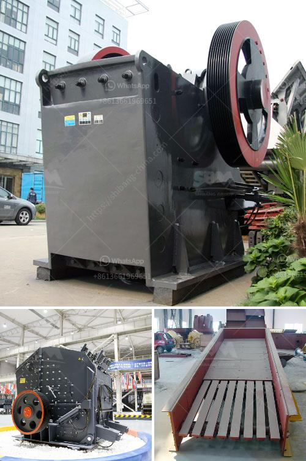

<h3>clinker grinding unit for cement clinker in india</h3>
Cement production is a highly energy-intensive process, encompassing various stages from raw material extraction to clinker formation and grinding. The clinker grinding unit is a crucial part of the cement production process, as it refines the clinker particles, produced during the kiln phase, into a fine powder that can be mixed with gypsum and other additives to produce the final cement product.

India's booming construction industry heavily relies on cement production to meet its infrastructural demands. With increased urbanization, infrastructural developments, and government initiatives like "Housing for All," the demand for cement has witnessed significant growth. In this context, the role of clinker grinding units becomes pivotal in enhancing the cement manufacturing capacity of India.

1. Cost-Effective Solution: Clinker grinding units offer a cost-effective solution for converting the clinker produced during the kiln phase into a fine and consistent powder. By grinding the clinker particles, the surface area of cement particles is increased, leading to better reactivity and superior cement quality.

2. Environmental Benefits: Clinker grinding units also play a crucial role in sustainable cement production. By optimizing the clinker grinding process, the energy consumption per unit of cement produced is significantly reduced. This reduction in energy consumption leads to a lower carbon footprint, minimizing environmental impacts.

3. Capacity Expansion: Clinker grinding units enable cement manufacturers to increase their production capacity without constructing new cement plants. The addition of clinker grinding units facilitates flexibility in scaling up the production capacity as per market demands. This adaptability also ensures better utilization of existing infrastructure and resources.

India, being the second-largest cement producer globally, has a robust network of cement manufacturers. There are several clinker grinding units in different parts of the country, contributing significantly to the cement production capacity of India.

Major clinker grinding units in India include UltraTech Cement, Ambuja Cement, Shree Cement, and JK Cement. These companies have state-of-the-art manufacturing facilities that utilize advanced technology and modern equipment for clinker grinding. Their units not only focus on producing high-quality cement but also adhere to sustainable manufacturing practices.

While the clinker grinding unit concept is gaining popularity in India, some challenges need to be addressed to maximize its potential. These challenges include:

1. Infrastructure Requirements: Setting up clinker grinding units requires substantial investments, including land acquisition, machinery, and infrastructure development. Developing the necessary infrastructure can sometimes pose logistical and financial challenges.

2. Regulatory Compliance: Adhering to regulatory guidelines regarding pollution control, waste management, and occupational health and safety is essential for clinker grinding units. Ensuring compliance with all the necessary regulations can be a challenge.

However, with the increasing demand for cement and the government's focus on affordable housing and infrastructure development, there are significant opportunities for clinker grinding units in India. Cement manufacturers can leverage these opportunities by adopting modern technologies, enhancing operational efficiency, and prioritizing sustainability.

The clinker grinding unit plays a vital role in the Indian cement industry by refining the clinker particles into a fine powder, thereby enhancing cement quality and production capacity. These units offer a cost-effective and sustainable solution for cement manufacturers, allowing them to meet the escalating demands of the construction sector.

While challenges exist, the opportunities for clinker grinding units in India are immense. With proper planning, investment, and adherence to regulatory norms, clinker grinding units can contribute to the growth and development of the construction industry, steering India towards a brighter and sustainable future.
<h3>Contact us</h3><ul><li><strong>Whatsapp:&nbsp;<a href="https://wa.me/8613661969651">+8613661969651</a></strong></li><li><a href="https://swt.shibang-china.com/?git&amp;zhl&amp;clinker grinding unit for cement clinker in india"><strong>Online Service(chat now)</strong></a></li></ul><h3>Related</h3><ul><li><a href='manganese washing equipment cost.md'>manganese washing equipment cost</a></li><li><a href='manufacturer of conveyor belts.md'>manufacturer of conveyor belts</a></li><li><a href='used dolomite jaw crusher price malaysia.md'>used dolomite jaw crusher price malaysia</a></li><li><a href='vibrating feeder sinter oret.md'>vibrating feeder sinter oret</a></li><li><a href='indonesia coal crusher stamler agent.md'>indonesia coal crusher stamler agent</a></li></ul>