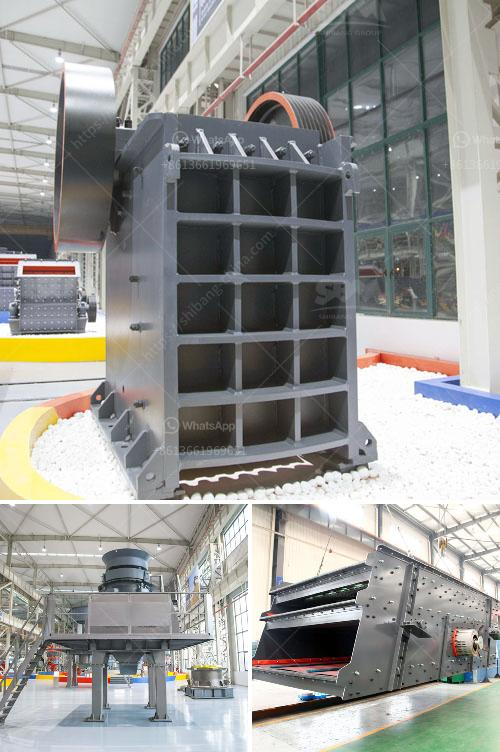

<h3>clinker making machine for sell germany</h3>
Germany is renowned for its engineering prowess and technological advancements. This reputation extends to its machinery and equipment manufacturing industry, which produces high-quality and efficient machines for various sectors. One such industry that greatly benefits from German expertise is the cement production industry. In particular, the clinker making machine is in high demand, and Germany stands as a leading manufacturer of such equipment.

A clinker making machine is an essential tool used in the production of cement. It is responsible for grinding raw materials into fine powder during the cement manufacturing process. Germany's clinker making machines are known for their precision engineering, durability, and efficiency, making them highly sought after in both domestic and international markets.

German clinker making machines are built to withstand rigorous conditions in cement factories. Made from high-quality materials, these machines offer excellent performance and require minimal maintenance. Their advanced technologies ensure consistent and reliable grinding of the raw materials, resulting in a high-quality end product. Whether it is limestone, clay, or other materials, a German clinker making machine can efficiently process them into the desired consistency.

Moreover, German clinker making machines are designed with safety as a top priority. They incorporate various safety features, such as emergency stop buttons, safety guards, and advanced control systems, to minimize the risk of accidents in the workplace. Furthermore, they adhere to strict international manufacturing standards, ensuring compliance with environmental regulations and contributing to sustainable production.

Germany's thriving machinery industry often allows customers to choose from a wide range of clinker making machines that suit their specific requirements. Whether a small-scale cement factory or a large industrial plant, there is a machine available to meet the needs of any production capacity. Additionally, German manufacturers offer excellent after-sales service and technical support to ensure customers' satisfaction long after the purchase.

In conclusion, if you are in the market for a clinker making machine, Germany is the go-to destination for the highest quality and most reliable equipment. With their precision engineering, durability, efficiency, and emphasis on safety, German manufacturers provide machines that consistently deliver outstanding results. From small-scale operations to large industrial plants, there is a clinker making machine for every production capacity. By choosing a German-made machine, you can benefit from the country's engineering expertise and be confident in the longevity and performance of your investment in the cement production industry.
<h3>Contact us</h3><ul><li><strong>Whatsapp:&nbsp;<a href="https://wa.me/8613661969651">+8613661969651</a></strong></li><li><a href="https://swt.shibang-china.com/?git&amp;zhl&amp;clinker making machine for sell germany"><strong>Online Service(chat now)</strong></a></li></ul><h3>Related</h3><ul><li><a href='thailand about stone crusher plant.md'>thailand about stone crusher plant</a></li><li><a href='dolomite stone crusher plant cost.md'>dolomite stone crusher plant cost</a></li><li><a href='quarry equipment for sale in south africa.md'>quarry equipment for sale in south africa</a></li><li><a href='vsi crusher manufacturers.md'>vsi crusher manufacturers</a></li><li><a href='grinding and mixing machine for quartz.md'>grinding and mixing machine for quartz</a></li></ul>