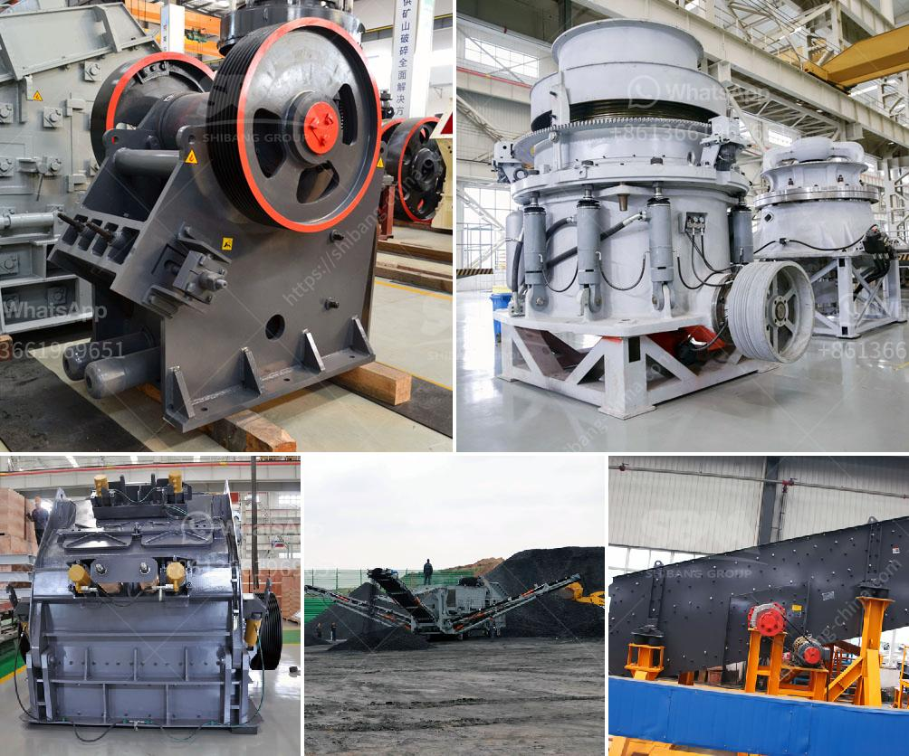

<h3>coal and grinding machine cost</h3>
Coal, a fossil fuel, has been used by humans for countless years as a major energy source. With its high carbon content and energy density, coal has been crucial in powering industries and generating electricity. However, the process of extracting coal from the earth and preparing it for use has evolved significantly over time, leading to the development of grinding machines that efficiently grind coal into a fine powder.

Grinding machines have become an integral part of the coal mining industry, as they are essential in extracting energy from coal. These machines crush coal into a fine powder and mix it with hot air, enabling efficient combustion and energy generation. As a result, the demand for grinding machines capable of handling coal has significantly increased.

The cost of grinding machines depends on several factors, including the quality and durability of the machine itself, the complexity of the grinding process, and the maintenance requirements. In general, grinding machines that specialize in coal are more expensive due to the specific engineering requirements necessary for successful coal grinding.

When considering the cost of coal grinding machines, it is important to consider the long-term benefits they offer. Efficient grinding machines consume less energy during the grinding process, resulting in reduced electricity costs. Moreover, the fine powder produced by these machines enhances combustion efficiency, reducing overall coal consumption.

Besides the cost of the machine itself, one must also consider the operational costs associated with running and maintaining grinding machines. These costs include energy consumption, regular maintenance, and occasional repairs. However, the quality and durability of the machine contribute to reducing maintenance costs in the long run.

In conclusion, coal grinding machines play a vital role in the coal mining industry, contributing to the safe and efficient extraction of energy from coal. While their cost may vary depending on factors such as quality, complexity, and maintenance requirements, they offer long-term benefits in terms of reduced electricity consumption and enhanced combustion efficiency. As the demand for coal continues to grow, so does the need for efficient grinding machines that can handle the grinding process effectively.
<h3>Contact us</h3><ul><li><strong>Whatsapp:&nbsp;<a href="https://wa.me/8613661969651">+8613661969651</a></strong></li><li><a href="https://swt.shibang-china.com/?git&amp;zhl&amp;coal and grinding machine cost"><strong>Online Service(chat now)</strong></a></li></ul><h3>Related</h3><ul><li><a href='sand crushing machine.md'>sand crushing machine</a></li><li><a href='list mining equipments are used in granite quarries.md'>list mining equipments are used in granite quarries</a></li><li><a href='crusher jaw crusher.md'>crusher jaw crusher</a></li><li><a href='dolomite stone crusher plant cost.md'>dolomite stone crusher plant cost</a></li><li><a href='china cement grinding unit manufacturers.md'>china cement grinding unit manufacturers</a></li></ul>