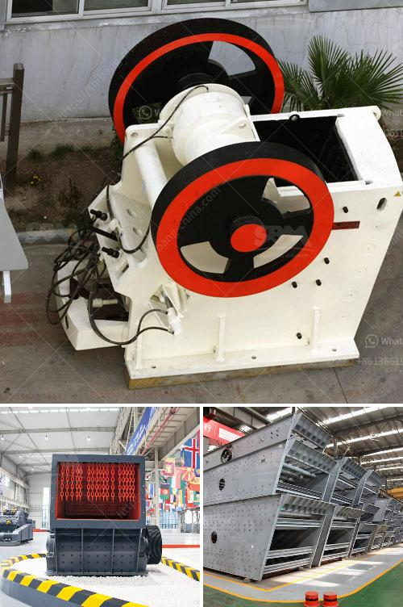

<h3>coal ball mill in india from coal dust</h3>
Coal has been a prominent source of energy in India for many years. However, with the advent of renewable energy sources like solar and wind, there has been a growing concern over the environmental impact of coal usage. In response to this, the Indian government has taken various initiatives to reduce the dependency on coal and promote cleaner alternatives. One such initiative is the utilization of coal ball mills.

A coal ball mill is a type of grinder used to grind and blend materials for use in mineral dressing processes, paints, pyrotechnics, ceramics, and selective laser sintering. It works on the principle of impact and attrition: size reduction is done by impact as the balls drop from near the top of the shell. A ball mill consists of a hollow cylindrical shell rotating about its axis. The axis of the shell may be either horizontal or at a small angle to the horizontal. It is partially filled with balls. The grinding media is the balls, which may be made of steel, stainless steel, ceramic, or rubber.

Coal dust is a fine powdered form of coal, which is created by the crushing, grinding, or pulverizing of coal. Because of the brittle nature of coal, coal dust can be created during mining, transportation, or by mechanically handling coal. It is a form of fugitive dust, meaning that it is airborne for some time and can be carried by wind to different distances.

Using coal ball mills to grind coal dust not only reduces environmental pollution due to its efficiency but also helps utilize coal dust in a more effective way. In India, a country with high energy needs, coal dust is often a byproduct of coal mining and transportation. These unused coal dust can be converted into usable fuel by grinding it into fine particles and then burning it in a controlled manner. This not only reduces coal waste but also reduces the dependency on imported coal, thus making India more self-reliant in energy production.

Moreover, coal ball mills are designed with precision and are known for their exceptional performance. They are capable of grinding coal to a fine powder that is suitable for efficient combustion in the boiler of a power plant. This ensures the maximum heat release and minimizes unburned carbon in the ash.

In conclusion, coal ball mills are a promising technology for reducing the environmental impact of coal usage in India. With the growing emphasis on cleaner alternatives, it is essential to find efficient and sustainable ways to utilize coal dust. By grinding it into fine particles and burning it in a controlled manner, coal ball mills help in maximizing energy production while minimizing environmental pollution. It is a step in the right direction towards a cleaner and more sustainable future for India's energy needs.
<h3>Contact us</h3><ul><li><strong>Whatsapp:&nbsp;<a href="https://wa.me/8613661969651">+8613661969651</a></strong></li><li><a href="https://swt.shibang-china.com/?git&amp;zhl&amp;coal ball mill in india from coal dust"><strong>Online Service(chat now)</strong></a></li></ul><h3>Related</h3><ul><li><a href='kenya jaw crusher is manufactured.md'>kenya jaw crusher is manufactured</a></li><li><a href='gypsum making machine india.md'>gypsum making machine india</a></li><li><a href='pe series jaw crusher rate 1000ton per hour.md'>pe series jaw crusher rate 1000ton per hour</a></li><li><a href='cement plants capacities of lafarge in nigeria.md'>cement plants capacities of lafarge in nigeria</a></li><li><a href='cotizacion de equipos mineros.md'>cotizacion de equipos mineros</a></li></ul>