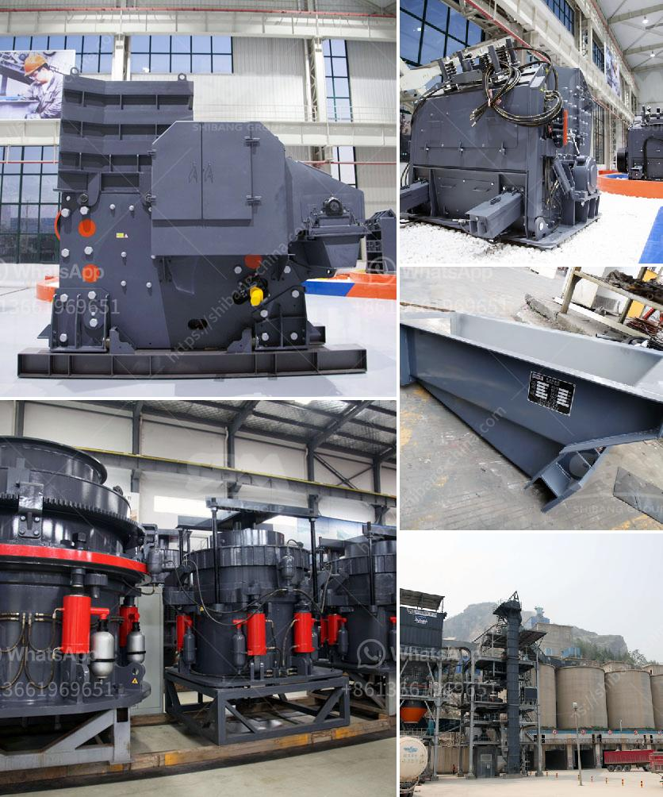

<h3>coal crusher machine 5 ton per hours</h3>
Coal crusher machine 5 ton per hours is a crusher type utilized to crush the large coal briquettes or chunks into smaller shapes. Coal crusher machine plays a vital role in coal mining and processing industries. It is an essential piece of equipment in the coal preparation plant.

Coal crushing machines have varied specifications and capacity. They are capable of crushing coal of different sizes, ensuring optimal efficiency and smooth operation. The coal crusher machine capacity is generally measured in tons per hour.

Different coal crusher machines have different structure and design. Some of them are specifically designed for crushing coal with higher moisture content, whereas some are designed to crush coal with low moisture content. These machines are available with different feed opening sizes, allowing users to choose the size that best suits their requirements.

The coal crusher machine 5 ton per hours is widely used to crush large scale coal mines. It can crush coal as large as tons per hour and can operate continuously for 24 hours so that it generates the required coal supply and increases the efficiency of the coal preparation plant.

Coal crushers have various types, such as jaw crushers, impact crushers, and cone crushers. Popular coal crusher machines include jaw crusher and impact crusher. Jaw crusher is the preferred crusher for coal mining industry. It has the advantages of large crushing ratio, high production capacity and even product size. Jaw crusher is extensively used in mining, metallurgy, construction, highway, and railway industry.

Another commonly used coal crusher machine is impact crusher. It is mainly used in coal mining, metallurgy, chemical industry, transportation, and other industries. It has the characteristics of small size, simple structure, large crushing ratio, and high production efficiency.

The capacity of coal crusher machine 5 ton per hours is determined by the type and specifications of the machine. Thus, fine-tuning the performance of the machine can optimize the crushing capacity. Coal crushers are essential equipment for coal mining and processing, providing a constant supply of coal to various industries.

In conclusion, coal crusher machine 5 ton per hours is a crusher machine capable of crushing large coal briquettes or chunks into smaller shapes. It is an essential piece of equipment in the coal preparation plant, serving the purpose of increasing the efficiency of coal mining and processing. Different coal crusher machines have different specifications and designs, but they all play a vital role in the coal industry. Choosing the right type and specification of coal crusher machine can optimize production capacity and ensure an uninterrupted supply of coal.
<h3>Contact us</h3><ul><li><strong>Whatsapp:&nbsp;<a href="https://wa.me/8613661969651">+8613661969651</a></strong></li><li><a href="https://swt.shibang-china.com/?git&amp;zhl&amp;coal crusher machine 5 ton per hours"><strong>Online Service(chat now)</strong></a></li></ul><h3>Related</h3><ul><li><a href='stone crusher machine company.md'>stone crusher machine company</a></li><li><a href='vibrating feeder zenith.md'>vibrating feeder zenith</a></li><li><a href='jaw crusher dealer in dubai.md'>jaw crusher dealer in dubai</a></li><li><a href='marble and granite grinder and crusher.md'>marble and granite grinder and crusher</a></li><li><a href='quartz plant in india.md'>quartz plant in india</a></li></ul>