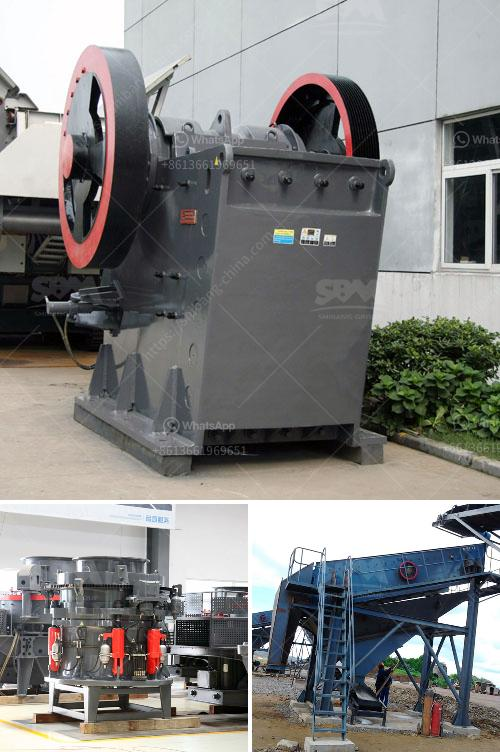

<h3>coal crusher manufacturer</h3>
In the ever-evolving landscape of mining and extraction industries, the role of coal crusher manufacturers has been significant. With the stringent emission norms and frequent government regulations on coal mining activities, the demand for advanced coal crushers has seen a steady rise. Manufacturers are investing in technology-oriented coal crushers to meet the changing demands of the industry.

Coal Crushers play a crucial role in the crushing industry, which provides coal as a vital fuel to various industries. For example, mining, transportation, construction, cement, and energy industries all rely on this fossil fuel. It is commonly utilized in open-pit mines as well as underground mines.

Technology has played a big role in the transformation of the coal mining industry and crushers are an integral part of that. Technological advancements play a crucial role in tackling challenges such as environmental concerns, tougher regulations, and tight profit margins.

Coal crusher manufacturers are investing in advanced research and development (R&D) for product innovation to enhance their product offerings. They are adopting technologies such as computerized numerical control (CNC) machines, automation systems, and advanced sensor-based sorting systems to improve productivity.

Implementing these advancements provides manufacturers with several benefits like increased efficiency, lower operating costs, and reduced maintenance requirements. The manufacturers are also focusing on enhancing the safety features of the crushers, ensuring a reduced risk for workers.

With increasing environmental concerns, governments worldwide are imposing stringent regulations on coal mining operations. Manufacturers have realized the importance of producing crushers that comply with these regulations to promote sustainability within their operations.

In response to these regulations, coal crusher manufacturers have developed crushers with advanced features that reduce emission levels in coal-fired power plants. Additionally, crushing techniques have undergone significant advancements to enhance the efficiency of coal crushers, resulting in reduced greenhouse gas emissions.

To cater to the changing demands of the global coal market, manufacturers are constantly innovating and adapting their products. Crushers with multiple chambers, high crushing ratios, and superior quality designs have become highly sought after by industry players.

Furthermore, manufacturers are focusing on offering crushers that not only crush coal efficiently but also efficiently process materials of various sizes and densities. This allows for improved utilization of coal resources and enhanced productivity in coal-fired power plants.

Coal crusher manufacturers continue to invest in technological advancements and innovation to meet the ever-changing demands of the industry. By adopting advanced research and development techniques, they aim to create crushers that comply with stringent environmental regulations and contribute to sustainable mining operations.

The use of cutting-edge technology and improved design features has led to the production of crushers that offer higher efficiency and decreased emissions. Additionally, the market demand for crushers capable of processing materials of various sizes and densities has led to the development of versatile crushers.

By embracing technological advancements and adapting to market demands, coal crusher manufacturers play a pivotal role in driving the growth and sustainability of the coal mining industry.
<h3>Contact us</h3><ul><li><strong>Whatsapp:&nbsp;<a href="https://wa.me/8613661969651">+8613661969651</a></strong></li><li><a href="https://swt.shibang-china.com/?git&amp;zhl&amp;coal crusher manufacturer"><strong>Online Service(chat now)</strong></a></li></ul><h3>Related</h3><ul><li><a href='crusher machine capacity 5 tons per hour.md'>crusher machine capacity 5 tons per hour</a></li><li><a href='cement grinding unit 100 tpd total.md'>cement grinding unit 100 tpd total</a></li><li><a href='rock crushing equipment to make stone dust.md'>rock crushing equipment to make stone dust</a></li><li><a href='jaw crusher size specifications.md'>jaw crusher size specifications</a></li><li><a href='ceramic crushing production line.md'>ceramic crushing production line</a></li></ul>