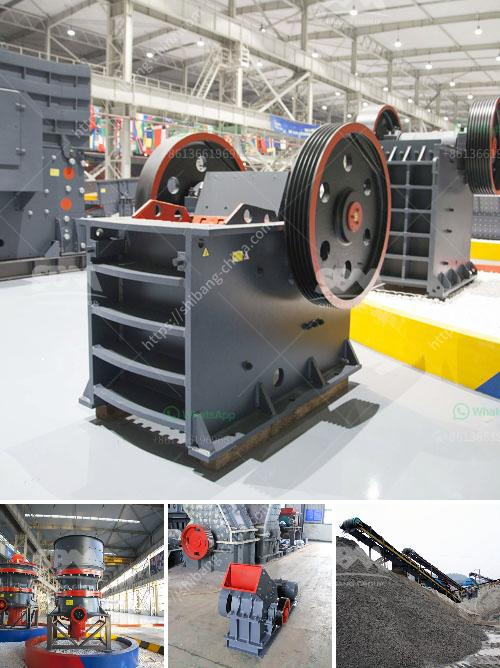

<h3>coal crusher suppliers</h3>
Coal, a fossil fuel, is the largest source of energy for the generation of electricity worldwide. Coal is extracted from the ground by mining, either underground or in open pits. Coal is primarily used as a solid fuel to produce electricity and heat through combustion. It is also used in the steel and cement industries as a fuel for extraction of iron from iron ore and for cement production.

Coal crushing process is the important coal processing in coal energy industry. SBM offers a full set of coal primary crushing and secondary crushing equipment to meet the clients' requirements. SBM coal crusher manufacturer in china is the professional exporter and supplier of coal crushing and screening plant in India.

Coal crusher machine,coal grinding mill plant, mobile coal pulvarizer manufacturer in india, Indonesia,china. Coal Material Introduction. coal beds or coal seams. Coal is a combustible black or brownish-black sedimentary rock usually occurring in rock strata in layers or veins called coal beds or coal seams. The harder forms, such as anthracite coal, can be regarded as metamorphic rock because of later exposure to elevated temperature and pressure. Coal is composed primarily of carbon along with various quantities of other elements, chiefly hydrogen, sulfur, oxygen, and nitrogen.

Coal crushing plant acts as the key crushing plant in this process. Primary coal crusher works in the first stage of coal crushing process. Coal raw materials are firstly poured into vibrating feeder, which they will be fed into primary coal crusher continuously and evenly. Primary crusher is usually jaw crusher or impact crusher, producing lump coal cinder.

Secondary coal crusher crushes the lump coal cinder transported by coal conveyor. Secondary coal crusher usually includes hydraulic impact crusher, cone crusher and JC jaw crusher. It produces sand size coal particlc which can be used in pretreatment of coal directly. Tertiary coal crusher resizes coal particlc into coal powder.

Tertiary crusher is used in special occasions like the coal grinding mill has special requirements on the feeding size. Cone crusher can act as the tertiary coal crusher because of its fine final outlets. coal plant 250 tph - 300 tph. Coal Crushing & Grinding. coal crusher. coal mill.
<h3>Contact us</h3><ul><li><strong>Whatsapp:&nbsp;<a href="https://wa.me/8613661969651">+8613661969651</a></strong></li><li><a href="https://swt.shibang-china.com/?git&amp;zhl&amp;coal crusher suppliers"><strong>Online Service(chat now)</strong></a></li></ul><h3>Related</h3><ul><li><a href='cement mill motor for sale uk.md'>cement mill motor for sale uk</a></li><li><a href='stone crusher machine for sale tanzania.md'>stone crusher machine for sale tanzania</a></li><li><a href='silica sand stone machine china.md'>silica sand stone machine china</a></li><li><a href='cs series cone crusher agents in south africa.md'>cs series cone crusher agents in south africa</a></li><li><a href='crusher manufacturers in germany.md'>crusher manufacturers in germany</a></li></ul>