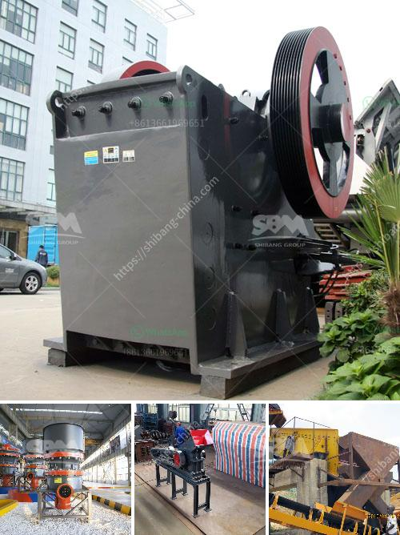

<h3>coal crushing and screening plant in south africa</h3>
Coal crushing and screening plant is one of the key parts of coal preparation. In general, coal is crushed and then screened to the desirable particle size, which can be put into grinding mill to become powder. There are many types of coal crushing and screening plants in South Africa, including jaw crusher, cone crusher, impact crusher, mobile crusher and portable crushing and screening plant. SBM is a professional supplier of coal crushing and screening plant in South Africa.

The popular crushing and screening equipment from SBM Machinery are: jaw crusher, cone crusher, impact crusher, vibrating screen, sand making machine and vibrating feeder, etc. In coal crushing plant, our pe jaw crusher or pew jaw crusher is primary crusher machine, then pf impact crusher is secondary crusher, the last crusher is cone crusher, we often use the hcs cone crusher or hp cone crusher. In coal grinding process, which coal mining equipments is normally used ball mill, vertical mill, and ultrafine grinding mill.

SBM coal crushing and screening plant for sale in India,South Africa.SBM jaw coap crusher,hammer crusher,cone crusher,ball mill,vibrating screen,pre-wet screen with high quality but low price.

SBM offer coal crushing and screening plant for sale in India, South Africa. SBM is leader in coal crushing and screening plant design, providing mobile and fixed crushing and screening plants with high capacity and good quality.A wide variety of mobile coal crushing plant options are available to you, such as jaw crusher, cone crusher, and impact crusher. Get Price And Support Online; coal processing plant crusher for sale australiaKamy . coal crushing plant australia dubai crusher. coal crusher manufacturer in .

Coal crushing and screening plant is used in Indonesia mining production line. Coal jaw crusher, cone crusher, hammer crusher and the vibrating screen cooperate with each to form a whole coal mining line for the local industry application. Indonesia Coal Crushing Plant. Coal crushers are sold under license from SBM in Indonesia.get price

Coal Handling Plant With an aim to stand tall on the expectations of our esteemed clients, we are providing Coal Handling Plant that is used for shifting coal through bucket elevators to boiler bunkers from wagon tippler hopper and trucks. In adherence to set industry standards the offered...

The coal handling plant consists of a crusher, screening plant, stockpile stacker, reclaimer and delivering system for our customers – either by conveyor, rail or truck. The coal is delivered to the plant in large rear dump trucks. These dump their load of 130 tonnes into a 500-tonne capacity bin.

The coal then goes through a screen and the 30mm fraction is crushed through a Bradford roll crusher and then separated into two fractions via a pneumatic sorter. The pulverized coal drops down into one of 32 storage bunkers and is then conveyed to the coal-fired boilers.

The coal crushing process is suitable to create the appropriate particle size for the different applications. With machines like impact crushers, hammer mills, single roller crushers, and double rollers coal products for a variety of industries can be produced.

Due to the low ash content and calorific value, the coal product has a direct saving on fuel and electric power costs. The product can be made available in various fraction sizes to suit customer specifications.

The coal crushing and screening plant has two DSMAcoal crushers at its site. Storage capacity of coal is 1000 t. Chain conveyor is used for coal transportation from coal storage to the plant.

As we know, SBM coal crushing plant mainly consists of coal crusher, coal grinding mill, coal vibrating screen, coal vibrating feeder. SBM has confirmed that its newly developed coal crushing plant has already entered the market for a long time and is well received by customers. We are sure that SBM will reply you as soon as possible, and approach to customers satisfied with the product.
<h3>Contact us</h3><ul><li><strong>Whatsapp:&nbsp;<a href="https://wa.me/8613661969651">+8613661969651</a></strong></li><li><a href="https://swt.shibang-china.com/?git&amp;zhl&amp;coal crushing and screening plant in south africa"><strong>Online Service(chat now)</strong></a></li></ul><h3>Related</h3><ul><li><a href='charcoal making machine south africa.md'>charcoal making machine south africa</a></li><li><a href='stone crusher and quarry plant in galway ireland.md'>stone crusher and quarry plant in galway ireland</a></li><li><a href='quick lime production process.md'>quick lime production process</a></li><li><a href='prices of stone crusher.md'>prices of stone crusher</a></li><li><a href='jaw crusher seller in pakistan.md'>jaw crusher seller in pakistan</a></li></ul>