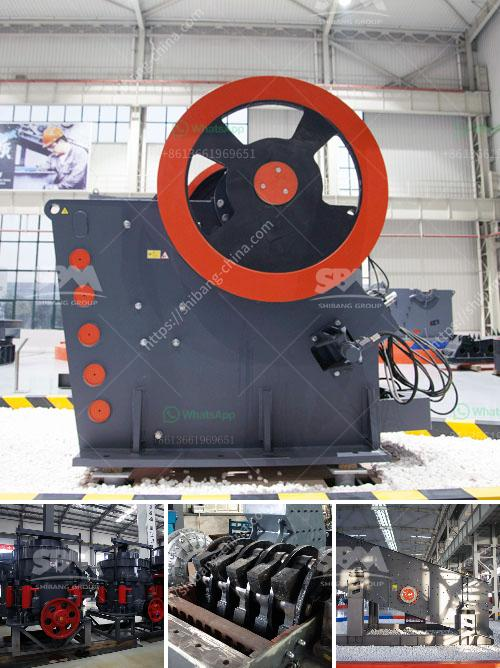

<h3>coal mill grinding media wear</h3>
Coal is one of the most essential resources in the global energy mix, providing a significant portion of the world's electricity generation. However, the process of coal grinding in a mill can be challenging, as the grinding media used in these mills may wear rapidly, leading to unwanted downtime and increased maintenance costs.

The coal grinding process is crucial in a thermal power plant, providing the fuel required to generate steam and power turbines. Grinding coal into fine powder requires large machinery and high temperatures, and grinding media play a vital role in this process.

Coal grinding media is designed to crush and grind the coal particles to a fine powder, enabling efficient combustion and energy release in the boiler. However, due to the abrasive nature of coal and the high temperature and pressure involved in the grinding process, the grinding media can experience significant wear.

The wear of grinding media in coal mills is influenced by various factors such as the coal's hardness, moisture content, pulverized fuel fineness, and mill operating conditions. Abrasive coal particles can cause the grinding media to break or become deformed, reducing their effectiveness in grinding the coal particles.

To mitigate grinding media wear in coal mills, manufacturers often use wear-resistant materials, such as high-chromium alloys or different ceramic materials. These materials have higher hardness and resistance to wear, prolonging the media's lifespan and minimizing downtime for media replacement.

In addition to using wear-resistant materials, coal mill operators can also optimize the mill's operating parameters to reduce wear. This includes adjusting the mill's speed, feed rate, and air flow to maintain an optimum grinding media-to-coal ratio, ensuring efficient grinding while minimizing wear.

Regular maintenance and inspection of coal mills are crucial to identifying early signs of wear or damage to the grinding media. By monitoring the wear patterns and replacing worn grinding media promptly, mill operators can prevent catastrophic failures and ensure the mill's efficient operation.

In conclusion, coal mill grinding media wear is a significant challenge in the coal grinding process in thermal power plants. By using wear-resistant materials, optimizing mill operating parameters, and conducting regular maintenance and inspections, mill operators can minimize media wear, enhance mill performance and efficiency, and optimize coal grinding for power generation.
<h3>Contact us</h3><ul><li><strong>Whatsapp:&nbsp;<a href="https://wa.me/8613661969651">+8613661969651</a></strong></li><li><a href="https://swt.shibang-china.com/?git&amp;zhl&amp;coal mill grinding media wear"><strong>Online Service(chat now)</strong></a></li></ul><h3>Related</h3><ul><li><a href='cost setting up silica sand ball mill.md'>cost setting up silica sand ball mill</a></li><li><a href='jaw crusher in dar es salaam.md'>jaw crusher in dar es salaam</a></li><li><a href='ball mill zenit crusher china.md'>ball mill zenit crusher china</a></li><li><a href='limestone crusher limestone crusher equipment.md'>limestone crusher limestone crusher equipment</a></li><li><a href='quarry crusher equipment for sale brisbane.md'>quarry crusher equipment for sale brisbane</a></li></ul>