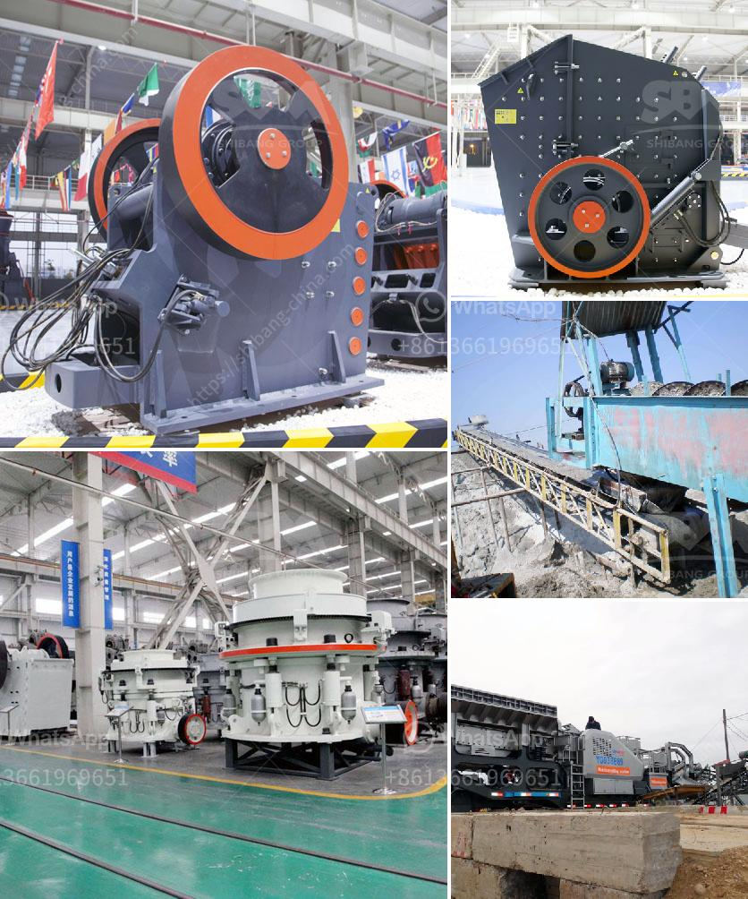

<h3>coal mining equipment in spain</h3>
Coal mining in Spain has a long history, dating back to the Roman times when it was used as fuel for heating and cooking. Over the centuries, the demand for coal increased with the rise of industrialization. As Spain embarked on its own industrial revolution in the late 18th century, coal became a vital resource for powering the growing number of factories and steam engines.

To extract coal efficiently and safely, specialized equipment is indispensable. Spain is home to several coal mining equipment manufacturers, serving both domestic and international markets. These companies design and produce various machines used in coal mines, ensuring the extraction process is efficient while prioritizing worker safety.

One such company is XYZ Mining Equipment, which has been at the forefront of supplying state-of-the-art machinery to Spanish coal mines for decades. Their equipment includes cutting machines, roof bolting rigs, and continuous miners, among others. These machines are carefully engineered to withstand harsh conditions underground, providing reliable performance even in challenging environments.

Spain's commitment to workplace safety has led to advancements in the mining equipment industry. Modern equipment is equipped with advanced safety features, such as proximity sensors and automatic shutdown systems, to prevent accidents and protect workers. Additionally, XYZ Mining Equipment has prioritized ergonomics, making their machines user-friendly and less physically demanding to operate.

As the global focus shifts towards renewable energy sources, the demand for coal has decreased significantly. However, Spain's coal industry remains vital for its domestic energy production. While the country is actively transitioning to cleaner energy alternatives, coal still plays a role in maintaining a stable energy supply during peak demand periods or when renewable sources are insufficient.

Coal mining equipment in Spain continues to evolve, aligning with changing demands and technological advancements. While the industry may face challenges in the future due to the declining demand for coal, Spanish manufacturers are adaptable and are exploring opportunities in other sectors. Their expertise in machinery production positions them to pivot towards manufacturing equipment for renewable energy solutions, ensuring their continued presence in the evolving energy landscape.
<h3>Contact us</h3><ul><li><strong>Whatsapp:&nbsp;<a href="https://wa.me/8613661969651">+8613661969651</a></strong></li><li><a href="https://swt.shibang-china.com/?git&amp;zhl&amp;coal mining equipment in spain"><strong>Online Service(chat now)</strong></a></li></ul><h3>Related</h3><ul><li><a href='equipments used in coal mining.md'>equipments used in coal mining</a></li><li><a href='iron ore crushing plant setup cost in india.md'>iron ore crushing plant setup cost in india</a></li><li><a href='stone crusher in pakistan.md'>stone crusher in pakistan</a></li><li><a href='to set up a stone crushing plant in bhutan.md'>to set up a stone crushing plant in bhutan</a></li><li><a href='how does a quarry operate complete crushing palnt.md'>how does a quarry operate complete crushing palnt</a></li></ul>