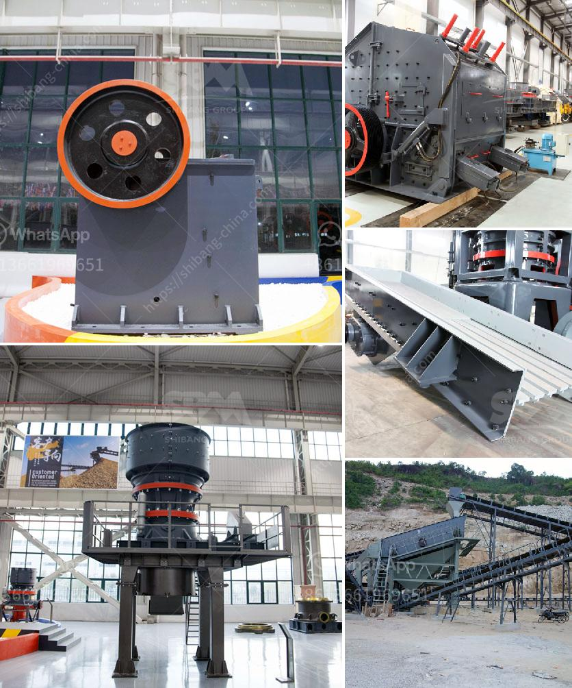

<h3>coal mining vibrating screens</h3>
Coal mining vibrating screens are important equipment for coal washing plants, coal beneficiation plants and other coal processing plants. They are used to separate coal particles from coal gangue and achieve the efficient utilization of coal resources. The coal vibrating screen manufactured by HXJQ Machinery is widely used in coal mines, metallurgy, building materials, refractory materials, light industry, and chemical industry, etc. It is especially suitable for screening large coal stones, coal blocks, coal powder, coal, gangue, coal, coke, and other materials.

The structure of the coal vibrating screen is simple and the drive system is relatively straightforward. It adopts the double shaft vibration exciter supported by four suspension springs, and the inclination angle between the two screen decks can be adjusted. In addition, the screen mesh can be replaced easily. The coal vibrating screen is equipped with several screen decks, from which the coal particles can be classified into different sizes.

The coal vibrating screen produced by HXJQ Machinery has multi-layer structure, which can realize the grading of coal particles according to specific particles. They can be widely used to screen various materials such as coal, limestone, marble, coke, quartz sand, various stone materials, and so on, in metallurgy, mining, coal, building materials, chemical industry, electric power, and other industries.

The vibrations of the coal vibrating screen machines are generated by vibration exciter. During the rotation of the eccentric shaft, the screen box vibrates, and the raw coal is periodically thrown onto the screen surface to complete the coal screening.

Coal particles are rarely found in a single size. Therefore, the classification of coal particles on the vibrating screen is close to a multilayer classification, which can be realized by single or multiple screen surfaces. For the circular vibrating screen, the most common reason for the poor screening effect is the inadequate inclination of the screen surface, so it is necessary to pad the back support. In practical application, the inclination angle of screen surface is more suitable when it is 20 degrees.

The vibrating screen of coal mine is widely used in screening, dewatering and de-intermediation of various materials. It has the advantages of stable operation, good sieving performance, and adjustable amplitude-frequency characteristics. It is more suitable for screening of fine-grained materials such as coal, limestone, gravel, gravel, metal or non-metallic ore and other materials.

The heavy-duty screen is specially designed for screening coal in coal handling plants. The high-frequency vibrating screens are usually operated at an inclined angle, traditionally varying between 0 and 25 degrees, and can go up to a maximum of 45 degrees.

Coal vibrating screens are a major noise source in coal preparation plants. Noise-induced hearing loss (NIHL) is recognized as one of the most common occupational diseases in the industry. Hearing loss can affect workers' ability to communicate and understand important safety warnings, which poses a significant risk. Therefore, noise control measures should be implemented to prevent NIHL in coal processing plants.

In conclusion, the coal mining vibrating screen is an important piece of equipment in the coal production line, which is mainly used to screen and separate coal stones, coal blocks, coal powder, coal, gangue, and other materials. By doing this, the efficiency of coal utilization can be improved. The coal vibrating screen manufactured by HXJQ Machinery has received unanimous praise from customers due to its high reliability, high efficiency, and high wear resistance. So, if you are interested in the coal vibrating screen, please contact us for details!
<h3>Contact us</h3><ul><li><strong>Whatsapp:&nbsp;<a href="https://wa.me/8613661969651">+8613661969651</a></strong></li><li><a href="https://swt.shibang-china.com/?git&amp;zhl&amp;coal mining vibrating screens"><strong>Online Service(chat now)</strong></a></li></ul><h3>Related</h3><ul><li><a href='limestone making size.md'>limestone making size</a></li><li><a href='cement plants capacities of lafarge in nigeria.md'>cement plants capacities of lafarge in nigeria</a></li><li><a href='china wet ball mill.md'>china wet ball mill</a></li><li><a href='business proposal for stone quarry project.md'>business proposal for stone quarry project</a></li><li><a href='crusher machine for sale in ethiopia.md'>crusher machine for sale in ethiopia</a></li></ul>