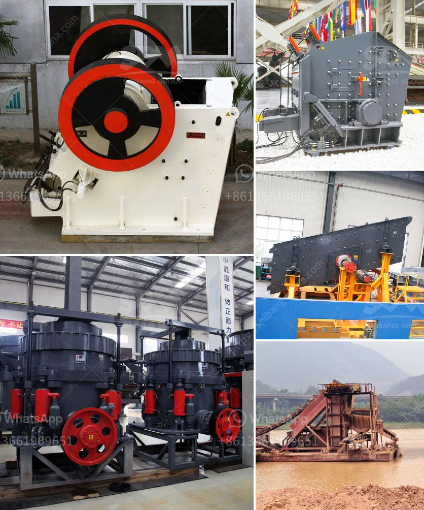

<h3>coal processing machine</h3>
Coal processing machines are essential equipment in the coal mining industry. These machines are used to separate impurities from coal, enabling efficient combustion and the production of cleaner energy. By removing impurities such as sulfur, ash, and rock, coal processing machines ensure that coal meets quality standards and is suitable for various applications.

One of the primary coal processing machines is the coal crusher. Designed to crush large coal chunks into smaller particles, this machine plays a crucial role in the coal processing industry. Coal crushers are used not only to reduce the size of coal but also to remove impurities and contaminants, ensuring high-quality end products.

Another important coal processing machine is the coal vibrating screen. This machine sieves the crushed coal to separate different sizes of particles. By doing so, it ensures uniformity in coal size, which is critical for proper combustion. Additionally, the coal vibrating screen helps in removing excess moisture from the coal, improving its heating value.

Coal washing machines are also essential for efficient coal processing. These machines use water and gravity separation techniques to remove impurities from coal. By washing coal, these machines reduce sulfur and ash content, making the coal more suitable for use in power plants and other industrial applications.

In recent years, advancements in coal processing technology have led to the development of more efficient and environmentally friendly coal processing machines. For example, some machines use dense medium separation (DMS) technology, which involves suspending coal in a dense medium fluid and then allowing different particles to settle at different rates. This process effectively separates impurities from coal, resulting in cleaner and higher-quality coal.

In conclusion, coal processing machines are crucial equipment in the coal mining industry. From coal crushers to vibrating screens and coal washing machines, these machines help remove impurities from coal, ensuring that it meets quality standards for various applications. With advancements in technology, coal processing machines are becoming more efficient, leading to cleaner energy production and reduced environmental impact.
<h3>Contact us</h3><ul><li><strong>Whatsapp:&nbsp;<a href="https://wa.me/8613661969651">+8613661969651</a></strong></li><li><a href="https://swt.shibang-china.com/?git&amp;zhl&amp;coal processing machine"><strong>Online Service(chat now)</strong></a></li></ul><h3>Related</h3><ul><li><a href='crusher manufacturers in saudi.md'>crusher manufacturers in saudi</a></li><li><a href='used horizontal impact crusher hazemag.md'>used horizontal impact crusher hazemag</a></li><li><a href='best mill for wet grinding of calcium carbonate.md'>best mill for wet grinding of calcium carbonate</a></li><li><a href='principle of jaw crusher operation.md'>principle of jaw crusher operation</a></li><li><a href='artificial sand making from sandstone.md'>artificial sand making from sandstone</a></li></ul>