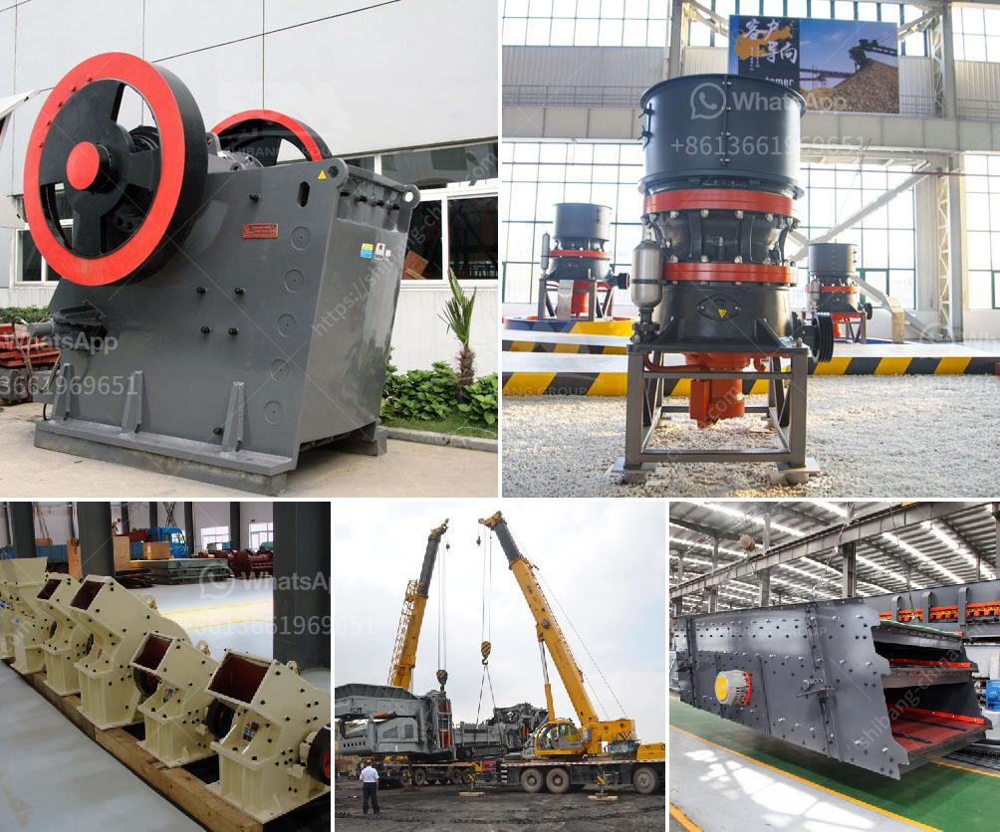

<h3>coal processing plant in australia</h3>
Australia is known for its plentiful natural resources, and coal is certainly one of them. Since the 1800s, Australia has been mining coal for energy production. And coal mining continues to be a significant industry in the country, providing jobs and powering the nation's electricity.

One integral part of the coal mining process is the coal processing plant. It plays a crucial role in turning raw coal into a usable form by transforming it into different grades and sizes for various purposes. The coal processing plant in Australia is designed to efficiently process high-quality coal using advanced technologies and machinery.

The coal processing plant recovers coal waste or tailings, using different processes, such as flotation, gravity separation, or dense media separation. The plant then processes the coal to remove impurities like rocks, dirt, ash, sulfur, and other substances, resulting in a cleaner, more efficient fuel.

In Australia, coal processing plants are located in various regions, including Queensland, New South Wales, Victoria, and Western Australia. These plants are strategically situated close to coal mines to minimize transportation costs and ensure a constant supply of coal for processing.

The processed coal from these plants is used in diverse industries. The majority of it is utilized by power stations to generate electricity; however, it also finds applications in cement manufacturing, steel production, and as a raw material for creating chemicals.

The significance of coal processing plants in Australia cannot be overstated. They not only contribute to the nation's energy security but also play a vital role in reducing environmental impact. Advanced technologies in these plants help decrease emissions, resulting in cleaner energy production.

Furthermore, coal processing plants provide employment opportunities to many Australians, especially in regional areas where these plants are often located. These jobs span various sectors, including engineering, maintenance, machinery operation, and administration.

In conclusion, the coal processing plant is an essential part of the Australian coal mining industry. It processes coal to remove impurities and prepares it for various applications. These plants contribute to the nation's energy production, provide employment, and play a vital role in minimizing environmental impact. As the demand for coal continues, the coal processing plants will play a pivotal role in ensuring a sustainable and efficient energy future for Australia.
<h3>Contact us</h3><ul><li><strong>Whatsapp:&nbsp;<a href="https://wa.me/8613661969651">+8613661969651</a></strong></li><li><a href="https://swt.shibang-china.com/?git&amp;zhl&amp;coal processing plant in australia"><strong>Online Service(chat now)</strong></a></li></ul><h3>Related</h3><ul><li><a href='screening plant for hire south africa.md'>screening plant for hire south africa</a></li><li><a href='limestone manufacturing process.md'>limestone manufacturing process</a></li><li><a href='how to make a iron ore crusher machine.md'>how to make a iron ore crusher machine</a></li><li><a href='crusher machine capacity 5 tons per hour.md'>crusher machine capacity 5 tons per hour</a></li><li><a href='slag crusher machine kenya.md'>slag crusher machine kenya</a></li></ul>