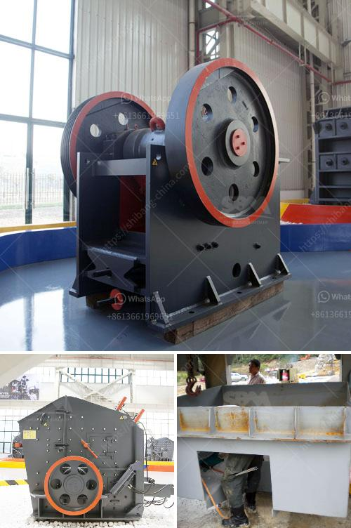

<h3>coal pulverizer manufacturers in south africa</h3>
Coal is a vital resource in South Africa, primarily for its energy efficiency. It is essential for various industrial processes as it generates electricity, provides heat for industrial applications, and serves as a valuable raw material for the production of various products such as cement, chemicals, and liquid fuels. To maximize the utilization of coal, efficient pulverization is crucial, and that is where coal pulverizer manufacturers play a crucial role.

Coal pulverizers are machines that crush coal into fine powder, allowing it to be burned efficiently. They come in various forms, ranging from small tabletop units to large industrial-sized machines. For proper combustion, coal needs to be ground to a specific particle size distribution, which can be achieved through the use of coal pulverizers.

South Africa has a significant amount of coal reserves, estimated to be around 30 billion tons, and is one of the largest coal producers in the world. With such abundant resources, it is no surprise that the country hosts several coal pulverizer manufacturers. These manufacturers specialize in designing and manufacturing pulverizing machines that enable efficient and reliable coal grinding.

One prominent coal pulverizer manufacturer in South Africa is Babcock Africa. Babcock Africa has 50 years of experience in the pulverization of coal, and has designed and built pulverizer plants for all types of coal across different industries. They have vast experience in the manufacturing of vertical spindle roller mill coal pulverizers, which are highly efficient and reliable units that are widely used in coal-fired power plants.

Another reputable coal pulverizer manufacturer in South Africa is Retsch. Retsch has been serving the scientific and industrial laboratories with its high-quality laboratory sample preparation equipment for over 100 years. They provide a wide range of pulverizers specifically designed for coal grinding, enabling precise and repeatable sample preparation for accurate analysis.

Furthermore, FLSmidth is a well-known name in the mining and cement industries, offering a wide range of equipment for pulverizing coal. They have a strong presence and decades of experience in South Africa, providing innovative and efficient solutions for coal grinding. FLSmidth's pulverizers are designed to handle various types of coal and can be customized to suit specific process requirements.

These are just a few examples of coal pulverizer manufacturers in South Africa. The country has a vibrant coal mining industry and is a net exporter of coal, making it a significant player in the global coal market. The manufacturers mentioned above, along with others, contribute to the efficient utilization of coal resources by providing robust and reliable pulverizing machines.

In conclusion, coal is a crucial resource in South Africa, and efficient pulverization of coal is essential for its optimal utilization. Coal pulverizer manufacturers play a vital role in ensuring that coal is ground to the desired particle size for efficient combustion. The examples mentioned in this article showcase the expertise and capability of South African manufacturers in producing reliable coal pulverizers. With their contribution, South Africa can maximize the use of its abundant coal resources for various industrial applications.
<h3>Contact us</h3><ul><li><strong>Whatsapp:&nbsp;<a href="https://wa.me/8613661969651">+8613661969651</a></strong></li><li><a href="https://swt.shibang-china.com/?git&amp;zhl&amp;coal pulverizer manufacturers in south africa"><strong>Online Service(chat now)</strong></a></li></ul><h3>Related</h3><ul><li><a href='busines project proposal for stone crusher.md'>busines project proposal for stone crusher</a></li><li><a href='how to start a concrete block business.md'>how to start a concrete block business</a></li><li><a href='clinker grinding unit for cement clinker in india.md'>clinker grinding unit for cement clinker in india</a></li><li><a href='how different impact crusher and hammer mill.md'>how different impact crusher and hammer mill</a></li><li><a href='copper crusher for sale in malaysia.md'>copper crusher for sale in malaysia</a></li></ul>