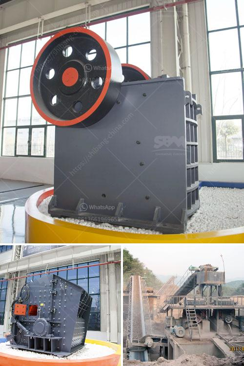

<h3>coarse powder grinding mill</h3>
Coarse powder grinding mill is a machine that is widely used in the mining industry. The main purpose of this machine is to grind large coarse particles into smaller particles of various sizes. It can crush materials with a maximum hardness of 9.3 on the Mohs scale and particle sizes ranging from 30 to 80 mesh.

This grinding mill has many advantages over traditional mills. First, it has a high production capacity. With its unique design, it can grind more materials in a shorter time, which makes it ideal for large-scale production. Second, it is energy-efficient. The motor power of this machine is lower compared to other mills, which means it consumes less energy during operation.

Another key advantage of this grinding mill is its versatility. It can grind a wide range of materials, including limestone, barite, dolomite, calcite, gypsum, and bentonite. These materials are commonly used in industries such as construction, paper manufacturing, and chemical production. The ability to grind such a variety of materials makes it a valuable tool for many different industries.

The coarse powder grinding mill also has a user-friendly design. It is easy to operate and maintain, which makes it suitable for both experienced operators and those who are new to the industry. The machine is equipped with a safety device to prevent accidents during operation. It also has a dustproof design, which helps to maintain a clean and safe working environment.

In addition to its advantages, there are a few considerations to keep in mind when using a coarse powder grinding mill. First, it is important to choose the right size of the machine based on the desired particle size of the final product. It is also crucial to use the correct grinding media to achieve the desired results. Additionally, regular maintenance and cleaning are necessary to ensure the longevity of the machine.

Overall, the coarse powder grinding mill is a valuable machine for grinding large coarse particles into smaller particles. Its high production capacity, energy efficiency, and versatility make it a preferred choice for many industries. With its user-friendly design and safety features, it can be operated by experienced operators and beginners alike. However, proper maintenance and care are essential to prolong its lifespan and ensure optimal performance.
<h3>Contact us</h3><ul><li><strong>Whatsapp:&nbsp;<a href="https://wa.me/8613661969651">+8613661969651</a></strong></li><li><a href="https://swt.shibang-china.com/?git&amp;zhl&amp;coarse powder grinding mill"><strong>Online Service(chat now)</strong></a></li></ul><h3>Related</h3><ul><li><a href='pebble production line.md'>pebble production line</a></li><li><a href='india gypsum powder equipment.md'>india gypsum powder equipment</a></li><li><a href='crankshaft of a jaw crusher.md'>crankshaft of a jaw crusher</a></li><li><a href='gold processing equipment.md'>gold processing equipment</a></li><li><a href='thailand about stone crusher plant.md'>thailand about stone crusher plant</a></li></ul>