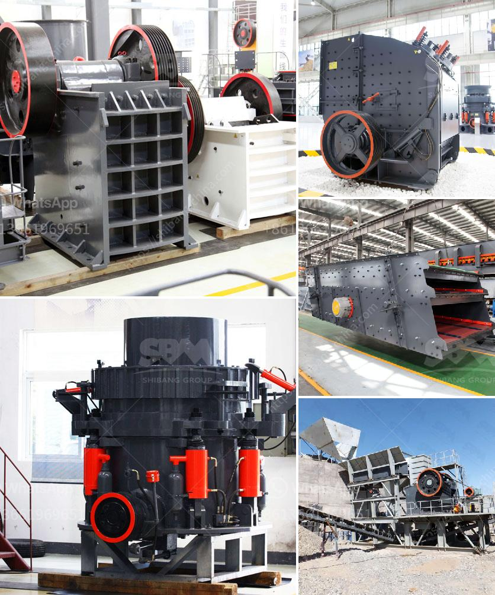

<h3>complete stone quarry plant</h3>
Stone quarrying is a multi-stage process that involves extracting rock from the ground and crushing it to produce construction aggregates. The demand for these materials continues to rise, making quarrying a vital industry worldwide. To meet this demand efficiently and sustainably, a complete stone quarry plant is essential. This article explores the components of such a plant and its significance in quarrying operations.

A complete stone quarry plant typically consists of several crushing stages, including primary, secondary, and tertiary crushers. These crushers break down large rocks into smaller sizes for further processing. The primary crusher, usually a jaw crusher or gyratory crusher, is responsible for initial rock reduction. It is designed to handle the largest and hardest rocks commonly found in quarries.

Once the primary crushing stage is completed, the secondary crusher takes over. It further reduces the size of the crushed material, making it more manageable for subsequent processes. Common types of secondary crushers include cone crushers and impact crushers. They are capable of producing a range of sizes suitable for various construction applications.

The final stage of the crushing process is performed by the tertiary crusher. This crusher produces the smallest size of aggregates required for specific purposes, such as concrete production or road construction. Tertiary crushers can be either vertical shaft impact (VSI) crushers or cone crushers, depending on the desired final product shape.

In addition to the crushing components, a complete stone quarry plant includes equipment for material handling, screening, and washing. Conveyors transport the crushed rock from one stage to another, ensuring smooth and efficient flow throughout the plant. Vibrating screens separate the aggregates based on size, allowing for the production of different grades of materials.

Furthermore, a stone quarry plant may incorporate a washing system to remove impurities from the aggregates. This is particularly important for producing high-quality materials in compliance with industry standards. Washing equipment, such as sand screws and cyclones, effectively clean the aggregates, improving their grading and overall performance.

The use of a complete stone quarry plant offers several advantages for quarrying operations. Firstly, it ensures the efficient and continuous production of aggregates, meeting the growing demand. With all the necessary equipment in place, the plant can handle large volumes of rock, maximizing productivity.

Secondly, a complete plant allows for better control over the quality of the final product. By incorporating different stages of crushing and screening, operators can produce aggregates of specific sizes and shapes according to customer requirements. This flexibility enhances customer satisfaction and opens up opportunities for specialized applications.

Lastly, a complete stone quarry plant demonstrates commitment to sustainable quarrying practices. By efficiently utilizing the available resources and following environmentally friendly processes, a well-designed plant minimizes waste and energy consumption. Additionally, incorporating washing equipment ensures the production of clean and durable aggregates, reducing the environmental impact of construction projects.

In conclusion, a complete stone quarry plant is crucial for efficient and sustainable quarrying operations. Its various components, including crushers, material handling equipment, screens, and washing systems, work together to produce high-quality aggregates in desired sizes. With the ability to adapt to customer specifications and meet the rising demand, such a plant facilitates the growth and success of the quarrying industry, both economically and environmentally.
<h3>Contact us</h3><ul><li><strong>Whatsapp:&nbsp;<a href="https://wa.me/8613661969651">+8613661969651</a></strong></li><li><a href="https://swt.shibang-china.com/?git&amp;zhl&amp;complete stone quarry plant"><strong>Online Service(chat now)</strong></a></li></ul><h3>Related</h3><ul><li><a href='marble processing plant.md'>marble processing plant</a></li><li><a href='quarry equipment for sale in south africa.md'>quarry equipment for sale in south africa</a></li><li><a href='roller crusher machine manufacturer.md'>roller crusher machine manufacturer</a></li><li><a href='jaw crushers for sale in saudi.md'>jaw crushers for sale in saudi</a></li><li><a href='cost of lead zinc beneficiation plant.md'>cost of lead zinc beneficiation plant</a></li></ul>