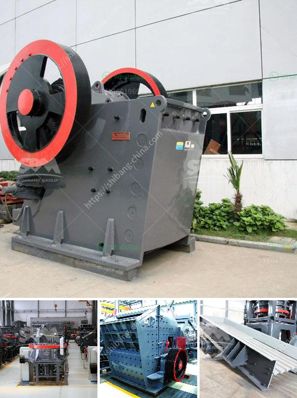

<h3>components of a limestone primary plant</h3>
Limestone is a versatile rock that has been used for centuries in various applications, ranging from construction to agriculture. To maximize its potential, a limestone primary plant includes several key components that work together to produce high-quality limestone products. These components include the primary crusher, conveyors, screens, and auxiliary equipment.

The primary crusher is the heart of the limestone primary plant. It plays a crucial role in the initial size reduction of the limestone rocks. Typically, the primary crusher consists of a jaw crusher or impact crusher, depending on the desired size of the output material. The crusher breaks down the limestone rocks into smaller pieces, ensuring they are suitable for further processing.

Once the limestone rocks are crushed, they are transported from the primary crusher to the secondary processing stage using conveyors. These conveyors are designed to efficiently and safely move the crushed limestone from one area of the plant to another. Conveyors can be adjustable in length and height, allowing for flexibility in plant layout and ensuring smooth material flow throughout the processing stages.

After the limestone is transported through the conveyors, it moves onto screens. Screens are used to separate different sizes of limestone particles, ensuring that the final products meet specific size requirements. Vibrating screens are commonly used in limestone primary plants, as they efficiently separate the oversize material and remove any fines. This process helps to ensure consistent quality in the limestone products.

As part of the limestone primary plant, auxiliary equipment is also necessary to support the overall operation. This auxiliary equipment includes feeders, dust collectors, and storage systems. Feeders are used to regulate the flow of limestone into the primary crusher, ensuring a constant supply of material. Dust collectors are vital to maintaining a clean and safe working environment by capturing and filtering any airborne dust particles. Storage systems are crucial for storing and stockpiling limestone products before they are transported to customers.

In addition to the core components mentioned above, other equipment can be incorporated into a limestone primary plant to optimize operations. This includes crushers equipped with advanced technologies, such as automation features for precise control, impactors for higher reduction ratios, or cone crushers for finer crushing. Depending on the specific requirements of the plant, these additional components can be tailored to meet the desired results.

It is essential to maintain and regularly service all components of a limestone primary plant to ensure efficient and reliable operation. Routine inspections, lubrication, and replacing worn parts are part of regular maintenance practices. This increases the lifespan of the equipment, reduces downtime, and ultimately maximizes productivity.

In conclusion, a limestone primary plant comprises various components that work together to produce high-quality limestone products. These components include the primary crusher, conveyors, screens, and auxiliary equipment such as feeders, dust collectors, and storage systems. Each component plays a crucial role in the overall limestone processing operation. By understanding the functionality of each component and implementing regular maintenance, plant operators can optimize productivity and produce consistent, quality limestone products.
<h3>Contact us</h3><ul><li><strong>Whatsapp:&nbsp;<a href="https://wa.me/8613661969651">+8613661969651</a></strong></li><li><a href="https://swt.shibang-china.com/?git&amp;zhl&amp;components of a limestone primary plant"><strong>Online Service(chat now)</strong></a></li></ul><h3>Related</h3><ul><li><a href='stone crushing making machine.md'>stone crushing making machine</a></li><li><a href='stone crusher to make gravel.md'>stone crusher to make gravel</a></li><li><a href='quarrying crusher machine.md'>quarrying crusher machine</a></li><li><a href='300tpd cement plant price.md'>300tpd cement plant price</a></li><li><a href='start m sand unit kerala cost.md'>start m sand unit kerala cost</a></li></ul>