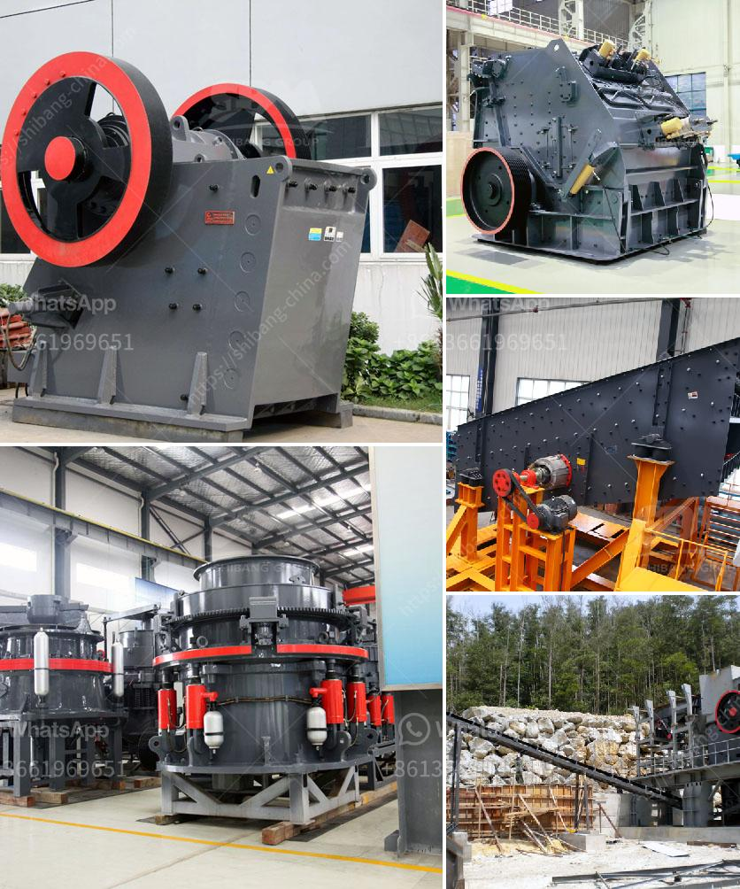

<h3>components of industrial conveyor belts</h3>
Industrial conveyor belts are essential tools used in various industries to transport materials and products efficiently. They play a significant role in streamlining production processes and ensuring the smooth and continuous flow of goods. Understanding the components of industrial conveyor belts is crucial to maintaining their functionality and maximizing their lifespan. In this article, we will explore some of the key components of these indispensable tools.

1. Belt Material: The material used for the conveyor belt itself is of paramount importance. It must possess qualities such as high wear resistance, tensile strength, and flexibility to withstand the rigorous demands of industrial applications. Common belt materials include rubber, PVC, polyester, and nylon. The selection of the belt material depends on the specific requirements of the application, such as the weight and type of material being transported.

2. Pulleys: Pulleys are essential components that facilitate the movement of the conveyor belt. They are typically cylindrical in shape and made of sturdy materials such as steel or aluminum. The conveyor belt wraps around the pulleys, which are attached to a motor-driven shaft, enabling the belt to move along the conveyor system. Pulleys are designed to provide a smooth and frictionless surface for the belt to glide over, ensuring efficient operation.

3. Rollers: Conveyor belt rollers are crucial for supporting the weight of the conveyed material and guiding the belt along the intended path. They are often made of steel, aluminum, or plastic and are mounted on the conveyor frame. Rollers can be powered or idler, with powered rollers facilitating the movement of the belt, while idler rollers provide support and stability. The number and configuration of rollers depend on the conveyor's design and load-carrying capacity.

4. Idlers: Idlers, also known as pulley bearings, serve as a pivot point for the conveyor belt and help maintain its tension. They are typically located along the conveyor's length to support the belt and prevent sagging. Idlers are equipped with rolling bearings, often made of steel or other durable materials, to reduce friction and increase belt longevity. Proper alignment and spacing of idlers are essential for maintaining belt stability and preventing excessive wear.

5. Conveyor Frame: The conveyor frame provides the structural support for the entire conveyor system. It is constructed using materials such as steel or aluminum, chosen for their strength and durability. The frame holds all the components in place and ensures the stability and alignment of the conveyor belt. The design of the frame may vary, depending on the specific application and space constraints.

6. Belt Cleaners: Industrial conveyor belts often accumulate debris, dust, and other contaminants during operation, which can lead to reduced efficiency and increased wear. Belt cleaners are devices installed at the head and/or tail pulleys to remove these particles and maintain the cleanliness of the belt. They can be in the form of scrapers, brushes, or air knives, depending on the type of conveyor and the material being conveyed.

In conclusion, the components of industrial conveyor belts work together to ensure smooth and efficient material transport. Each component plays a crucial role and must be carefully selected, installed, and maintained to ensure optimal performance and longevity. By understanding these components, industries can enhance their productivity, minimize downtime, and reduce operational costs.
<h3>Contact us</h3><ul><li><strong>Whatsapp:&nbsp;<a href="https://wa.me/8613661969651">+8613661969651</a></strong></li><li><a href="https://swt.shibang-china.com/?git&amp;zhl&amp;components of industrial conveyor belts"><strong>Online Service(chat now)</strong></a></li></ul><h3>Related</h3><ul><li><a href='quartz powder special production line for mining.md'>quartz powder special production line for mining</a></li><li><a href='crushers for rent cincinnati.md'>crushers for rent cincinnati</a></li><li><a href='cs cone crusher.md'>cs cone crusher</a></li><li><a href='calcium carbonate for ball mill.md'>calcium carbonate for ball mill</a></li><li><a href='crankshaft of a jaw crusher.md'>crankshaft of a jaw crusher</a></li></ul>