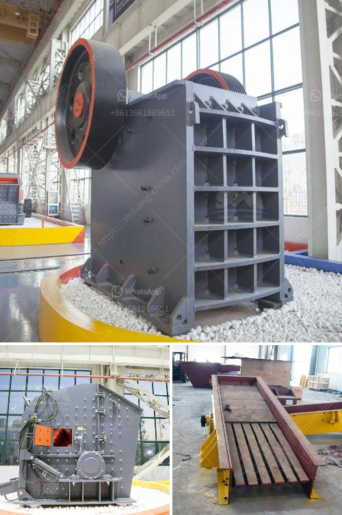

<h3>concrete crushing machines</h3>
Concrete crushing machines are used to reduce the size of concrete waste materials in a controlled and efficient manner. These compact and portable machines can open up new opportunities for construction firms, contractors, and other businesses dealing with waste concrete materials.

One of the key benefits of using concrete crushing machines is the ability to recycle waste concrete materials, which helps to reduce construction costs and minimize the environmental impact. Instead of disposing of concrete waste materials in landfills, these machines can crush them into smaller pieces that can be reused as aggregates for new concrete production.

The process of concrete crushing involves feeding the waste concrete into a machine, which then uses mechanical force to break it down into smaller pieces. The machine is equipped with strong jaws that exert pressure on the concrete to crush it into smaller pieces.

Concrete crushing machines are versatile and can be used for various applications, including recycling asphalt, brick, and glass materials as well. These machines are ideal for the demolition of buildings, bridges, sidewalks, and other structures, as they can easily process and crush concrete onsite.

Some concrete crushing machines are equipped with a vibrating screen, which allows the users to sort the crushed concrete particles by size and remove any contaminants that might be present. This ensures that the recycled concrete meets the required specifications for use in new construction projects.

In addition to reducing waste and recycling materials, concrete crushing machines offer several other advantages. They are compact and portable, which makes them easy to transport and move from one job site to another. This allows contractors to crush concrete onsite, eliminating the need to transport waste materials to a crushing facility.

Furthermore, concrete crushing machines are cost-effective solutions for contractors, as they eliminate the need to purchase new aggregates for construction projects. By recycling waste concrete materials, contractors can save money on purchasing new materials while also reducing their carbon footprint.

In conclusion, concrete crushing machines offer a sustainable and efficient solution for the reduction and recycling of waste concrete materials. These machines not only help to protect the environment but also provide cost and time-saving benefits for construction firms and other businesses. By investing in concrete crushing machines, companies can contribute to a greener future while also improving their bottom line.
<h3>Contact us</h3><ul><li><strong>Whatsapp:&nbsp;<a href="https://wa.me/8613661969651">+8613661969651</a></strong></li><li><a href="https://swt.shibang-china.com/?git&amp;zhl&amp;concrete crushing machines"><strong>Online Service(chat now)</strong></a></li></ul><h3>Related</h3><ul><li><a href='busines project proposal for stone crusher.md'>busines project proposal for stone crusher</a></li><li><a href='quick lime production process.md'>quick lime production process</a></li><li><a href='stone crushing making machine.md'>stone crushing making machine</a></li><li><a href='mining equipment for sale harare zimbabwe.md'>mining equipment for sale harare zimbabwe</a></li><li><a href='mining equipment for sale.md'>mining equipment for sale</a></li></ul>