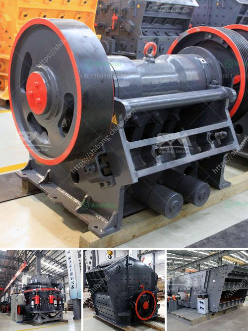

<h3>concrete recycling crushing machine</h3>
Concrete is one of the most widely used materials in construction projects, but it also poses a significant environmental challenge. With the continuous need for infrastructure upgrades and new construction, the amount of concrete waste generated is increasing at an alarming rate. This raises the need for effective concrete recycling methods, and one such method is the use of concrete recycling crushing machines.

Concrete recycling crushing machines are advanced turnkey solutions that can be utilized to crush and screen unwanted concrete materials for reuse. These machines are a game-changer in the efforts to recycle concrete. Indeed, crushing and screening concrete waste are valuable processes that enable companies to repurpose the material instead of discarding it as waste.

One of the main advantages of concrete recycling crushing machines is their ability to handle a wide variety of materials. These machines can process concrete with rebar, asphalt, and other materials commonly found in demolition and construction waste. This versatility allows operators to process different types of concrete waste, making the machine a valuable asset for various projects.

The process of concrete recycling starts with the feeding of the unwanted concrete materials into the crushing machine. The powerful jaws of the machine crush the material into smaller pieces, which are then passed through screens to separate the desired size of aggregate. The aggregates can be used as an alternative to natural aggregates in the production of new concrete or as a base material for road construction.

In addition to reducing landfill waste, concrete recycling crushing machines also contribute to the reduction of carbon emissions. Producing new concrete from virgin materials is energy-intensive and releases a significant amount of CO2 into the atmosphere. By recycling concrete, the demand for new materials is reduced, resulting in a decrease in carbon emissions associated with the manufacturing process.

Moreover, concrete recycling crushing machines offer cost savings for construction projects. The use of recycled concrete materials eliminates the need for purchasing new aggregates, reducing the project's overall cost. Furthermore, recycling concrete waste helps mitigate disposal fees associated with landfilling, providing additional cost savings.

Concrete recycling crushing machines are not only beneficial for the environment and cost-effective for construction projects, but they also support sustainable development. By reusing concrete waste, natural resources are preserved, and the demand for virgin materials is reduced. This contributes to the long-term preservation of ecosystems and the overall sustainability of the construction industry.

In conclusion, concrete recycling crushing machines are essential tools in the efforts to recycle concrete waste. They offer a cost-effective and sustainable solution for repurposing unwanted concrete materials while reducing carbon emissions and protecting natural resources. As the construction industry continues to grow, it is crucial to prioritize the implementation of concrete recycling methods to minimize waste generation and contribute to a greener future.
<h3>Contact us</h3><ul><li><strong>Whatsapp:&nbsp;<a href="https://wa.me/8613661969651">+8613661969651</a></strong></li><li><a href="https://swt.shibang-china.com/?git&amp;zhl&amp;concrete recycling crushing machine"><strong>Online Service(chat now)</strong></a></li></ul><h3>Related</h3><ul><li><a href='dust cover for screening and crushing plant.md'>dust cover for screening and crushing plant</a></li><li><a href='china shanghai zenith company.md'>china shanghai zenith company</a></li><li><a href='calcite processing machine.md'>calcite processing machine</a></li><li><a href='sand washing machine.md'>sand washing machine</a></li><li><a href='granite mining business plan.md'>granite mining business plan</a></li></ul>