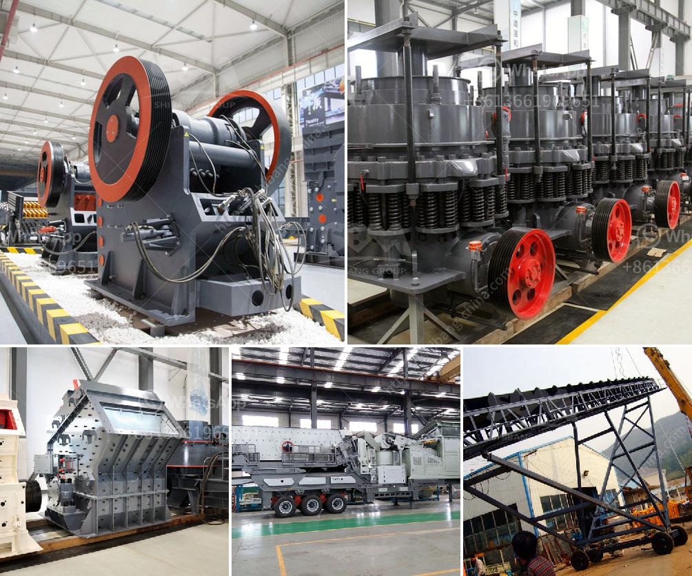

<h3>cone crusher for sale in ghana</h3>
Cone crushers are well known in the mining industry for their ability to crush hard and abrasive materials. They are ideal for secondary and tertiary crushing stages of various hard rock materials, including granite, basalt, limestone, and more. With the increase in demand for aggregates for construction projects in Ghana, the need for a reliable and efficient crushing solution has become more crucial.

Thanks to their robust design and high-quality manufacturing, cone crushers can withstand the toughest conditions and provide exceptional performance. They are equipped with powerful motors and advanced crushing technology that enable them to deliver consistent and uniform-sized aggregates.

In Ghana, cone crushers are mostly used in the mining industry and in the aggregate production process for crushing various rocks and ores. With the increasing demand for sand, gravel, and aggregates from construction sites, the need for a reliable and efficient crushing solution becomes more crucial to ensure productivity and profitability.

When looking for cone crushers for sale in Ghana, consider the following factors to ensure you choose the right equipment for your application:

1. Size and capacity: Determine the size and capacity requirements of your project to select the appropriate cone crusher model. Different models have varying crushing capacities, so it is essential to choose the one that can handle your production needs.

2. Maintenance and service: Look for cone crushers that are designed for easy maintenance and provide straightforward access to key components. This will save you time and money in the long run.

3. Quality and durability: Opt for cone crushers manufactured by reputable brands known for their quality and durability. This will ensure that your equipment lasts longer and performs reliably.

4. Price and value for money: Consider the cost of the cone crusher and compare it with its features and performance. Look for a balance between price and value for money to make an informed decision.

In conclusion, cone crushers are essential equipment for the mining and construction industries in Ghana. Take your time to research and consider the factors mentioned above to find the best cone crusher for sale that suits your specific needs and requirements. Don't compromise on quality, as investing in reliable equipment will ultimately contribute to your overall productivity and profitability.
<h3>Contact us</h3><ul><li><strong>Whatsapp:&nbsp;<a href="https://wa.me/8613661969651">+8613661969651</a></strong></li><li><a href="https://swt.shibang-china.com/?git&amp;zhl&amp;cone crusher for sale in ghana"><strong>Online Service(chat now)</strong></a></li></ul><h3>Related</h3><ul><li><a href='mobile crushing machine manufacturer.md'>mobile crushing machine manufacturer</a></li><li><a href='conveyor belt supplier in china.md'>conveyor belt supplier in china</a></li><li><a href='coal pulverizer manufacturers in south africa.md'>coal pulverizer manufacturers in south africa</a></li><li><a href='equipment required for alluvial gold mining.md'>equipment required for alluvial gold mining</a></li><li><a href='grinding milling equipment in south africa.md'>grinding milling equipment in south africa</a></li></ul>