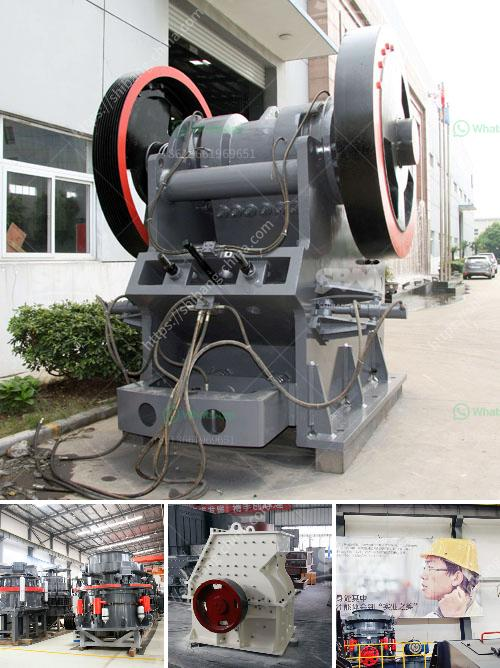

<h3>cone crusher for sale philippines</h3>
The cone crusher for sale Philippines, alternatively, uses the rotating oscillatory motion. The strain on the stones responds when caught in between the two cones. Finally, different feeding and discharging size. As said before, a jaw crusher is used for primary crushing purposes. Here, the stones employed for the input are larger in size. A mobile cone crusher is mostly present in the secondary and tertiary crushing of rock material during the process of aggregate production. It plays the primary role in the crushing of huge stones. Some of the features of the cone crusher are:

• The diversity in the crushing cavity in the cone crushers is amazing. It lets you select the cavity type based on your requirements. The capacity of the equipment while also reducing the power loss.

• The automatic control system allows for a remote control from a distance. The operator can use it to ascertain the equipment status and adjust the parameters according to the requirements.

• The anti-wear parts are long lasting and durable. The hydraulic protection provides a simplified structure, which reduces the difficulty of repairing and maintaining the cone crusher for sale Philippines.

The cone crusher for sale in the Philippines is an important equipment used commonly in the construction industry and mining industry. It can be used to crush various minerals and rocks such as basalt, granite, limestone, quartz stone, river pebbles, diabase, and other materials. It is especially suitable for medium and fine crushing of ores and rocks with different hardness. The machine has a compact structure, easy operation, stable performance, and can be used for long service life. With the development of the Philippines economy, more and more industries are growing, and the demand for mining machinery is also increasing. Cone crushers are also known as cone breakers. Compressive strength of cone crusher is no more than 250MPa. Cone crusher is widely used in mining, metallurgy, building materials, chemicals and other sectors to crush hard and medium-hard materials. Cone crusher is ideal for medium and small concentrators, and is suitable for the crushing of materials with hardness at middle and above. It is suitable for fine crushing and ultra-fine crushing of hard rocks, ores, slag, refractory materials, etc. Cone crusher improves the production capacity and crushing efficiency. It can be adopted to almost all types of materials from stone production to various ores crushing. It can provide unparalleled crushing performance in various medium crushing, fine crushing, and ultra-fine crushing operations. Cone crusher for sale Philippines is suitable for metallurgy, construction, road construction, chemical and silicate industry crushing of raw materials, can also be finely crushed, ultra-fine crushing operations, hard rock, ore, slag, refractory crushing. Cone crusher for sale Philippines has a lot of features, common with traditional crusher, with the structure of concentric shaft, the safety sleeve, the adjustment device, the adjustment ring, the spring and the frame, etc. With the advantages of high efficiency, easy operation and maintenance, low labor intensity and low cost.

In summary, cone crusher for sale Philippines is a kind of crushing machine commonly used for the crushing of various mineral ores, granite, granite, limestone, quartzite, sandstone, pebbles, etc. Cone crusher also uses the principle of laminating crushing, which is suitable for materials with high hardness. Compared with other types of crushing machinery, cone crusher for sale has higher performance and productivity. It is also the preferred equipment for crushing rocks and ore in large-scale mines and construction sites. Whether stationary or mobile, cone crushers are widely used in mining, metallurgy, construction, road construction, chemical, and silicate industry, and are suitable for crushing hard and medium-hard ores and rocks. Overall, cone crushers promote products with high-quality grain type, and improve the utilization rate of rock materials.
<h3>Contact us</h3><ul><li><strong>Whatsapp:&nbsp;<a href="https://wa.me/8613661969651">+8613661969651</a></strong></li><li><a href="https://swt.shibang-china.com/?git&amp;zhl&amp;cone crusher for sale philippines"><strong>Online Service(chat now)</strong></a></li></ul><h3>Related</h3><ul><li><a href='ball mill china making.md'>ball mill china making</a></li><li><a href='allis jaw crushers.md'>allis jaw crushers</a></li><li><a href='raymond mills usa.md'>raymond mills usa</a></li><li><a href='iron ore mines equipments.md'>iron ore mines equipments</a></li><li><a href='hammer grinding machine philippines.md'>hammer grinding machine philippines</a></li></ul>