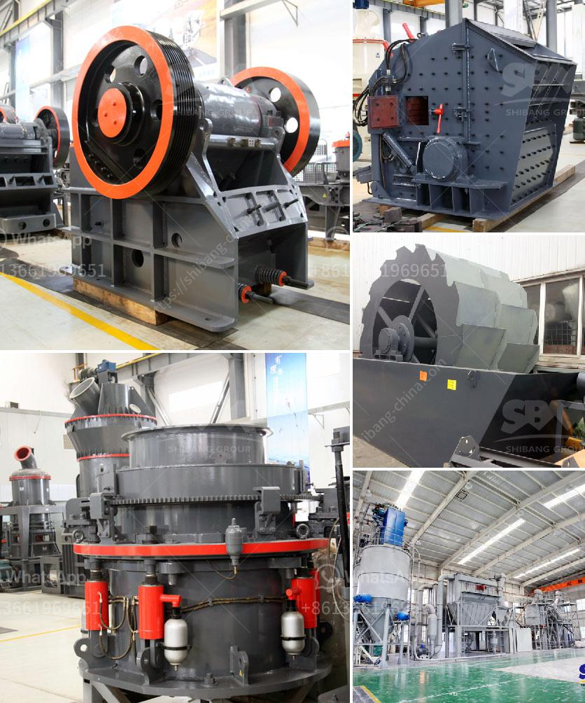

<h3>cone crusher for sale</h3>
When it comes to crushing equipment, there are many types of cone crushers available in the market. Cone crushers are meant to perform heavy-duty tasks while ensuring efficient and reliable operations. The main purpose of a cone crusher is to reduce the size of materials suitable for secondary crushing or tertiary crushing. Cone crushers are widely used in various industries, including mining, construction, and recycling.

One important factor to consider when choosing a cone crusher is its durability. A cone crusher for sale should be reliable and have a long service life. It should also have a versatile design that allows it to handle different types of materials. This is because cone crushers are used to crush a wide range of materials, including hard rocks, ore, and minerals.

Another essential feature to look for in a cone crusher for sale is its performance. A high-performing cone crusher should have a high crushing ratio and produce a consistent particle size. The cone crusher's power and capacity are also important factors in ensuring optimal performance. Cone crushers with greater power and larger crushing chambers can handle materials with higher hardness and provide better particle size control.

Ease of maintenance is another crucial aspect to consider when purchasing a cone crusher. A cone crusher for sale should be easy to maintain and service. This includes features such as easy access to the crusher's main components, as well as replaceable wear parts. Regular maintenance and proper servicing of the cone crusher are essential to maximize its performance and extend its lifespan.

Additionally, safety features are vital in ensuring the smooth and safe operation of a cone crusher. Cone crushers should be equipped with advanced safety features, including a hydraulic system that protects against overloads and tramp metal detection system to prevent damage caused by foreign objects. A cone crusher with these safety features can reduce the risk of accidents and protect both the operator and the machine.

One of the most important factors to consider when searching for a cone crusher for sale is the price. The cost of a cone crusher can vary depending on its features, capacity, and manufacturer. It is crucial to compare prices from different suppliers and consider the overall value and quality of the machine before making a purchase.

In conclusion, cone crushers are essential equipment in the crushing industry. When looking for a cone crusher for sale, factors such as durability, performance, ease of maintenance, safety features, and price should be considered. It is important to choose a cone crusher that meets specific requirements and provides efficient and reliable operations for the desired application. Finding the right cone crusher will ultimately contribute to the success of any crushing project.
<h3>Contact us</h3><ul><li><strong>Whatsapp:&nbsp;<a href="https://wa.me/8613661969651">+8613661969651</a></strong></li><li><a href="https://swt.shibang-china.com/?git&amp;zhl&amp;cone crusher for sale"><strong>Online Service(chat now)</strong></a></li></ul><h3>Related</h3><ul><li><a href='crushers for rent cincinnati.md'>crushers for rent cincinnati</a></li><li><a href='mobile mini crusher hire.md'>mobile mini crusher hire</a></li><li><a href='new stamp mill for sale in zimbabwe.md'>new stamp mill for sale in zimbabwe</a></li><li><a href='grinding machinery manufecture in africa.md'>grinding machinery manufecture in africa</a></li><li><a href='feldspar powder machine.md'>feldspar powder machine</a></li></ul>