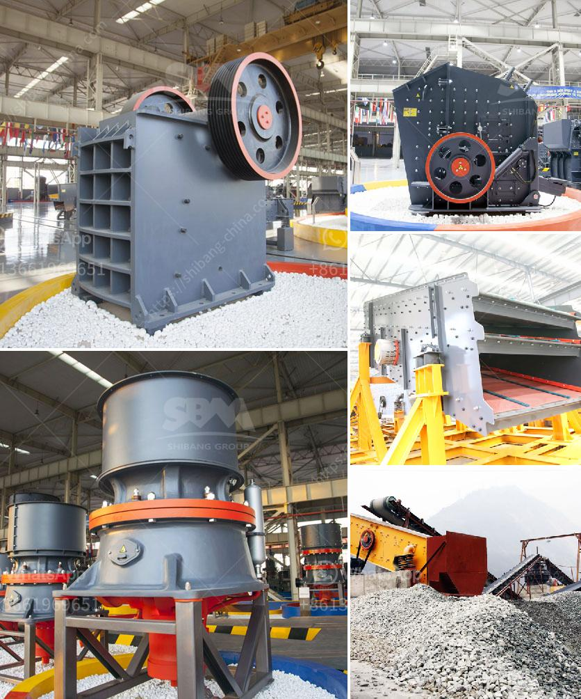

<h3>cone crusher sri lanka for sale</h3>
Cone crushers are commonly used in industries like mine, quarry, and construction to crush large stones or rocks into smaller pieces. They have a high performance, efficiency, and capacity, and can handle various materials such as granite, limestone, and iron ore. In Sri Lanka, cone crushers are available in several sizes and models to cater to the diverse needs of its users. This article will explore the cone crusher market in Sri Lanka, highlight its key features and benefits, and discuss tips on how to make an informed purchase.

One of the key advantages of cone crushers is their ability to produce a well-shaped product with consistent gradation. This is achieved through the use of a rotating mantle inside the crusher, which creates a high-pressure crushing action. The crushed material is then discharged through a discharge opening at the bottom of the crusher. This feature makes cone crushers ideal for producing aggregates for concrete, asphalt, and other construction applications.

In Sri Lanka, cone crushers are used extensively in the mining and quarrying industry. Whether it is aggregate production, mineral processing, or recycling, cone crushers excel in delivering performance and efficiency. Many local businesses and contractors rely on cone crushers to meet their crushing needs and ensure smooth operations.

When considering a cone crusher for sale in Sri Lanka, it is essential to assess the key features and benefits it offers. Firstly, the crusher should have a robust and durable construction to withstand the demanding conditions of a mining or quarrying environment. Stainless steel or manganese steel construction is preferred for its superior strength and longevity.

Secondly, the cone crusher should have a high crushing capacity to handle large volumes of material efficiently. The crusher's throughput, measured in tons per hour, indicates its capability to process material quickly. Higher throughputs are desirable for businesses with high production demands.

Another crucial factor to consider is the power source of the cone crusher. In Sri Lanka, the standard power source is electricity. However, considering the intermittent power supply in some remote areas, portable cone crushers powered by diesel engines are more suitable. These portable crushers can operate even in areas with no access to electricity, making them versatile and adaptable.

Moreover, it is essential to assess the maintenance requirements of the cone crusher. Regular maintenance ensures optimal performance and extends the lifespan of the machine. Look for cone crushers that are equipped with user-friendly features for easy maintenance, such as easily accessible service points and diagnostic systems.

Lastly, always buy from reputed suppliers or dealers with a proven track record in providing quality equipment and excellent customer support. Reliable suppliers offer warranty coverage, spare parts availability, and technical assistance, ensuring peace of mind for buyers.

In conclusion, cone crushers in Sri Lanka offer a reliable and efficient solution for crushing various materials in industries like mining, quarrying, and construction. With their unique features and benefits, cone crushers enhance productivity, improve product quality, and reduce operational costs. To make an informed purchase, evaluate the key features, consider the power source and maintenance requirements, and choose a reputable supplier. By doing so, businesses and contractors can invest in cone crushers that provide long-term value and exceptional performance.
<h3>Contact us</h3><ul><li><strong>Whatsapp:&nbsp;<a href="https://wa.me/8613661969651">+8613661969651</a></strong></li><li><a href="https://swt.shibang-china.com/?git&amp;zhl&amp;cone crusher sri lanka for sale"><strong>Online Service(chat now)</strong></a></li></ul><h3>Related</h3><ul><li><a href='grinding machine manufacturer for 300 mesh powder.md'>grinding machine manufacturer for 300 mesh powder</a></li><li><a href='cost of crushing equipments in nigeria.md'>cost of crushing equipments in nigeria</a></li><li><a href='floatation equipment for mining for sale in south africa.md'>floatation equipment for mining for sale in south africa</a></li><li><a href='crusher plant for sale in mardan.md'>crusher plant for sale in mardan</a></li><li><a href='slag grinding machine.md'>slag grinding machine</a></li></ul>