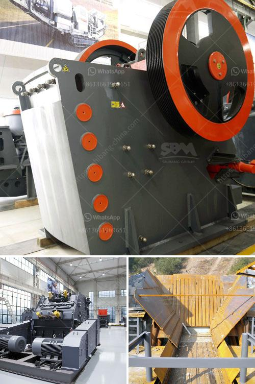

<h3>cone crusher supplier</h3>
When it comes to choosing the right cone crusher supplier, there are a variety of factors that need to be considered. From the type of cone crusher being used to the desired output and usage requirements, each situation demands a unique solution. This article will discuss important factors to consider when choosing a cone crusher supplier.

Cone crushers are used extensively in the mining and aggregate industries for crushing various materials. They come in different sizes, shapes, and designs, making it crucial to find the right supplier who can provide a suitable machine for your specific application. Whether you need a standard, short-head, or combination cone crusher, the supplier you choose should be able to provide the appropriate options and configurations.

One of the first things to consider when selecting a cone crusher supplier is their reputation in the industry. Look for a supplier with a strong track record of delivering high-quality products and reliable service. A reputable supplier will have positive customer reviews, as well as testimonials from satisfied clients. You can also check industry forums or ask for recommendations from industry professionals to gauge the reputation of a cone crusher supplier.

Another important consideration is the supplier's technical expertise. Look for a supplier who has a team of experienced engineers and technicians who can assist you in selecting the right cone crusher for your application. They should be knowledgeable about the latest advancements in cone crusher technology and be able to provide you with valuable advice and guidance. Furthermore, the supplier's technical team should offer prompt and efficient support for any issues or questions that may arise during the installation, operation, or maintenance of the cone crusher.

Price is always a factor when choosing any supplier, including cone crusher suppliers. While it's important to find a supplier who offers competitive pricing, it's equally crucial to consider the overall value rather than just the initial cost. A reliable supplier will offer a fair price for their cone crushers while ensuring that the quality and performance meet your expectations. It's recommended to obtain quotes from multiple suppliers to compare prices and to negotiate for any potential discounts or added benefits.

Furthermore, it's important to consider the supplier's after-sales service and support. A cone crusher is a complex piece of equipment that may require regular maintenance or repairs. A reputable supplier will provide comprehensive after-sales support, including training, spare parts availability, and technical assistance. This ensures that any issues or maintenance requirements can be addressed promptly, minimizing downtime and maximizing the lifespan of your cone crusher.

In conclusion, selecting the right cone crusher supplier can significantly impact the success of your crushing operation. By considering factors such as reputation, technical expertise, pricing, and after-sales support, you can find a reliable supplier who can provide the right cone crusher for your specific needs. Remember to thoroughly research and compare options before making a decision to ensure a long-lasting partnership with a reliable cone crusher supplier.
<h3>Contact us</h3><ul><li><strong>Whatsapp:&nbsp;<a href="https://wa.me/8613661969651">+8613661969651</a></strong></li><li><a href="https://swt.shibang-china.com/?git&amp;zhl&amp;cone crusher supplier"><strong>Online Service(chat now)</strong></a></li></ul><h3>Related</h3><ul><li><a href='dolomite production plant.md'>dolomite production plant</a></li><li><a href='roller crusher equipment manufacturer.md'>roller crusher equipment manufacturer</a></li><li><a href='grinding unit cement plant south africa.md'>grinding unit cement plant south africa</a></li><li><a href='jaw crusher in egypt.md'>jaw crusher in egypt</a></li><li><a href='basin a grinding roller mill.md'>basin a grinding roller mill</a></li></ul>