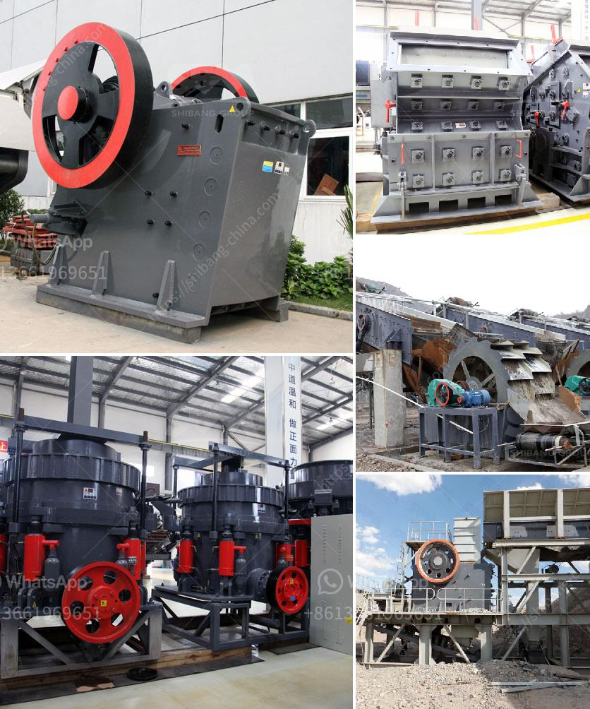

<h3>consol glass recycling price list south africa</h3>
In South Africa, where the majority of waste ends up in landfills, the importance of recycling has become increasingly evident. One area of recycling that has gained significant momentum is glass recycling. Consol Glass, a leading glass packaging manufacturer in the country, has played a crucial role in promoting glass recycling and offering competitive prices to encourage participation. This article delves into the Consol Glass recycling price list in South Africa, highlighting the benefits and contributing to a greener and more sustainable future.

Unlike other materials, glass can be recycled indefinitely without losing its quality. However, when glass is not recycled, it can take thousands of years to decompose. By recycling glass, South Africa can significantly reduce its carbon emissions, save energy, and conserve natural resources.

Consol Glass has been a pioneer in South Africa's glass recycling industry, actively working towards increasing recycling rates. With numerous drop-off centers across the country, Consol Glass promotes the convenience of glass recycling for both individuals and businesses.

To encourage more participation in glass recycling, Consol Glass has implemented a transparent pricing structure that benefits both glass collectors and recyclers. The price paid for recycled glass is determined by the color and type of glass, ensuring a fair payment system. The pricing structure ensures that individuals and businesses are fairly compensated for the effort and time invested in collecting and delivering glass bottles.

Consol Glass has a well-defined pricing structure based on the type and color of glass. While prices may vary from time to time, here is a general overview of the current Consol Glass recycling price list in South Africa:

It's important to note that these prices are subject to change, so it is recommended to contact local Consol Glass drop-off centers or recycling facilities for the most up-to-date information.

Apart from ensuring proper waste management, glass recycling offers numerous economic and environmental benefits. By recycling glass, South Africa reduces waste disposal costs, lowers carbon emissions, and conserves energy. The recycled glass can be used to manufacture new glass bottles, reducing the need for virgin raw materials.

Consol Glass's commitment to promoting glass recycling in South Africa is a step in the right direction. By providing a fair and transparent pricing structure, they encourage individuals and businesses to actively participate in glass recycling. As more people become aware of the economic and environmental benefits, the demand for glass recycling is expected to grow, contributing to a cleaner and more sustainable South Africa.
<h3>Contact us</h3><ul><li><strong>Whatsapp:&nbsp;<a href="https://wa.me/8613661969651">+8613661969651</a></strong></li><li><a href="https://swt.shibang-china.com/?git&amp;zhl&amp;consol glass recycling price list south africa"><strong>Online Service(chat now)</strong></a></li></ul><h3>Related</h3><ul><li><a href='cement mill startup procedures.md'>cement mill startup procedures</a></li><li><a href='cost of vertical raw mill.md'>cost of vertical raw mill</a></li><li><a href='crushed stone plant peru.md'>crushed stone plant peru</a></li><li><a href='gypsum granules machine in india.md'>gypsum granules machine in india</a></li><li><a href='stone crushers for sale in philippines.md'>stone crushers for sale in philippines</a></li></ul>