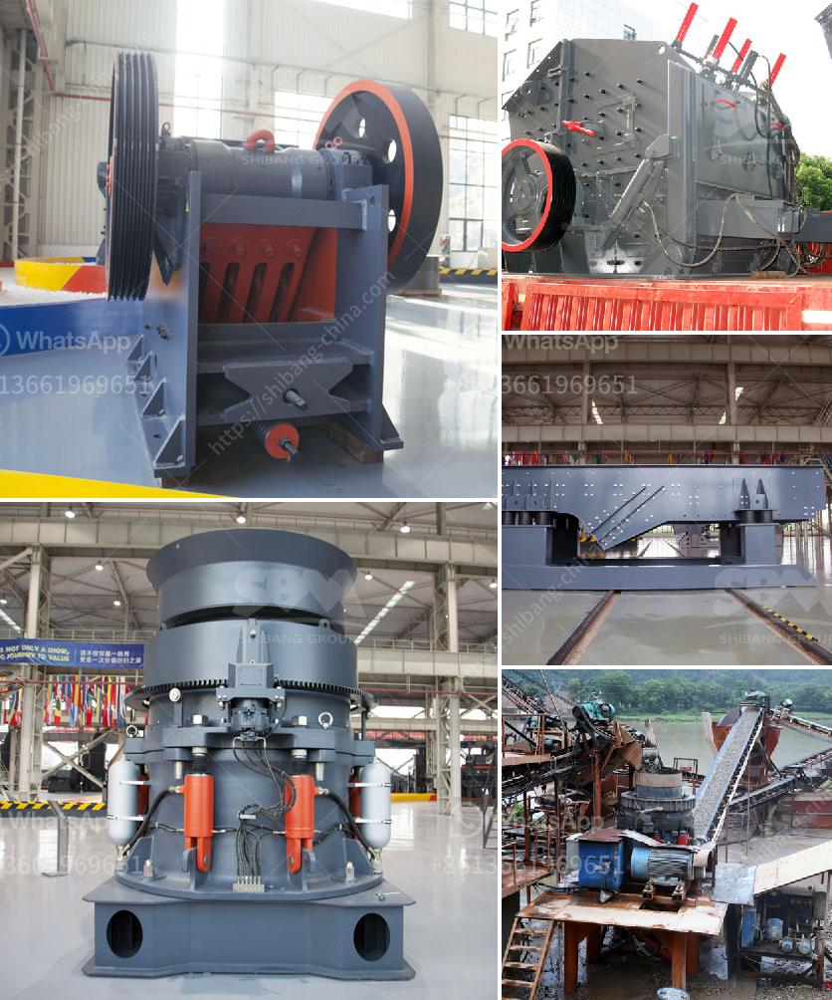

<h3>construction aggregates crusher</h3>
Construction aggregates are essential materials used in various construction projects, such as roads, bridges, buildings, and railways. They are primarily composed of rock, sand, gravel, or recycled concrete. To meet the demands of the construction industry, an efficient crusher is necessary to process these raw materials into the desired sizes for different applications. In this article, we will explore the significance of a construction aggregates crusher and its benefits in enhancing efficiency in the construction industry.

A construction aggregates crusher is a machine designed to crush rocks, diabases, and other similar materials to specified sizes for various applications. It operates by applying force to these materials by utilizing strong metal jaws or hammers that are mounted on a rotating shaft. The crushed materials can then be reused or transported to the construction site for further processing.

One of the primary benefits of using a construction aggregates crusher is that it helps in reducing the cost of construction. Compared to natural aggregates, processed aggregates obtained from crushing can be more cost-effective. The availability of a crusher on-site eliminates the need to purchase aggregates from external suppliers, thereby reducing transportation costs as well. Additionally, it allows for the utilization of local resources, promoting sustainability.

Efficiency is another crucial factor in construction projects, and a credible construction aggregates crusher plays a substantial role in enhancing efficiency. The crusher transforms large pieces of raw materials into smaller sizes, making them more manageable and easier to handle. This convenience speeds up the construction process and reduces the time required for site preparation. As a result, projects can be completed more swiftly, leading to overall cost savings.

Furthermore, using a construction aggregates crusher ensures consistent and quality materials. The uniformity in size achieved through crushing allows for better control over the mix design in concrete production. This consistency enhances the strength and durability of concrete structures, making them long-lasting and reducing the need for costly repairs or replacements. It also enables architects and engineers to design structures with greater precision, catering to specific project requirements.

In recent years, environmental concerns and sustainability have become crucial aspects of any construction project. Using a construction aggregates crusher aligns with the concept of sustainability by promoting the efficient use of resources. The crusher can handle various materials such as recycled concrete, reducing the demand for natural aggregates extraction. By reusing materials, it aids in preserving natural resources and reducing the environmental impact associated with extraction and transportation.

In conclusion, a construction aggregates crusher holds immense importance in the construction industry. It offers several benefits, such as cost savings, increased efficiency, consistent and quality materials, and sustainability. By investing in a reliable and efficient crusher, construction companies can optimize their operations, enhance project timelines, and contribute towards a more sustainable future.
<h3>Contact us</h3><ul><li><strong>Whatsapp:&nbsp;<a href="https://wa.me/8613661969651">+8613661969651</a></strong></li><li><a href="https://swt.shibang-china.com/?git&amp;zhl&amp;construction aggregates crusher"><strong>Online Service(chat now)</strong></a></li></ul><h3>Related</h3><ul><li><a href='used cement mills for sale in india.md'>used cement mills for sale in india</a></li><li><a href='methods of hammer mill.md'>methods of hammer mill</a></li><li><a href='copper ore refinement processors philippines.md'>copper ore refinement processors philippines</a></li><li><a href='density of balls for mills.md'>density of balls for mills</a></li><li><a href='basalt crusher machine prices.md'>basalt crusher machine prices</a></li></ul>