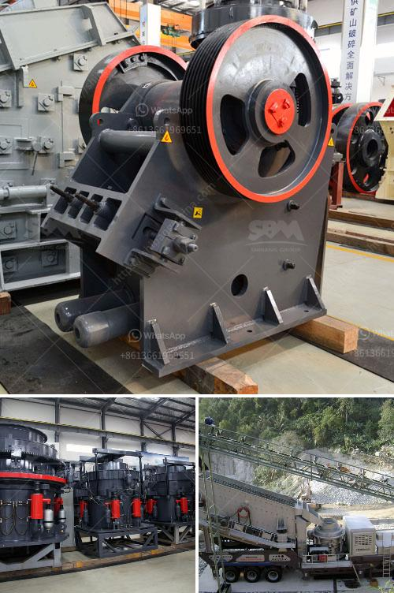

<h3>construction debris recycling</h3>
Construction is the backbone of any city's growth and development. It shapes skylines and provides modern infrastructure needed for a thriving society. However, as crucial as construction is, it generates a significant amount of debris and waste. Construction debris, such as concrete, wood, metal, and asphalt, can have a detrimental impact on our environment if not managed properly. This is where construction debris recycling plays a vital role in building a sustainable future.

Deconstruction, the process of carefully dismantling structures to salvage materials, is the first step towards construction debris recycling. By deconstructing buildings, valuable materials can be salvaged and repurposed, reducing the demand for new resources. These salvaged materials can then be used in new construction projects, reducing the amount of waste sent to landfills and conserving energy that would have been required to manufacture new materials.

Concrete, in particular, is a major component of construction debris. The recycling of concrete can have a significant environmental impact, as it reduces carbon emissions associated with the production of new concrete. Crushed concrete can be used as an aggregate in new construction projects, reducing the need for extraction of virgin materials such as gravel and sand. By recycling concrete, the construction industry can decrease its carbon footprint and promote sustainability.

Moreover, wood waste from construction sites poses its own set of challenges. However, this waste can be transformed into valuable resources through recycling. Wooden debris can be repurposed into mulch, compost, or used for biomass fuel. By recycling wood waste, construction companies can contribute to bioenergy production, minimizing the reliance on fossil fuels. Additionally, recycling wood products reduces the pressure on deforestation, preserving our precious forests and their biodiversity.

In recent years, the recycling of metals from construction debris has gained momentum. Metals, such as steel and aluminum, are highly valuable and can be endlessly recycled without losing their inherent properties. By recycling metals, the construction industry reduces the need for mining new ores, conserving natural resources and minimizing harmful extraction practices. Furthermore, the energy savings associated with recycling metals can be substantial, with estimates suggesting that recycling aluminum can save up to 95% of the energy required to produce new aluminum.

Asphalt, a common material in road construction, is another valuable resource that can be recycled. The use of reclaimed asphalt pavement (RAP) in new infrastructure projects reduces the need for new asphalt production. Recycling asphalt not only conserves natural resources but also reduces greenhouse gas emissions associated with the manufacturing process.

While construction debris recycling offers numerous environmental benefits, it also presents economic opportunities. Recycling facilities can collect, sort, and process construction debris, providing jobs and stimulating local economies. Additionally, recycling can lead to cost savings for construction companies, as recycled materials are often cheaper than their new counterparts. By embracing construction debris recycling, the construction industry can create a circular economy that benefits both the environment and the economy.

In conclusion, construction debris recycling plays a vital role in building a sustainable future. By salvaging and repurposing materials, we can reduce waste sent to landfills, conserve natural resources, and minimize carbon emissions. Concrete, wood, metal, and asphalt can all be recycled and reused, providing environmental and economic benefits. It is imperative for construction companies, policymakers, and communities to prioritize construction debris recycling, as it paves the way towards a greener and more sustainable future.
<h3>Contact us</h3><ul><li><strong>Whatsapp:&nbsp;<a href="https://wa.me/8613661969651">+8613661969651</a></strong></li><li><a href="https://swt.shibang-china.com/?git&amp;zhl&amp;construction debris recycling"><strong>Online Service(chat now)</strong></a></li></ul><h3>Related</h3><ul><li><a href='alluvial gold mining equipment used for sale.md'>alluvial gold mining equipment used for sale</a></li><li><a href='5hp industrial crusher mill.md'>5hp industrial crusher mill</a></li><li><a href='used stone crusher plant for sale andhra pradesh.md'>used stone crusher plant for sale andhra pradesh</a></li><li><a href='auto cad ball mill.md'>auto cad ball mill</a></li><li><a href='cheap used jaw rock crushers for sale.md'>cheap used jaw rock crushers for sale</a></li></ul>