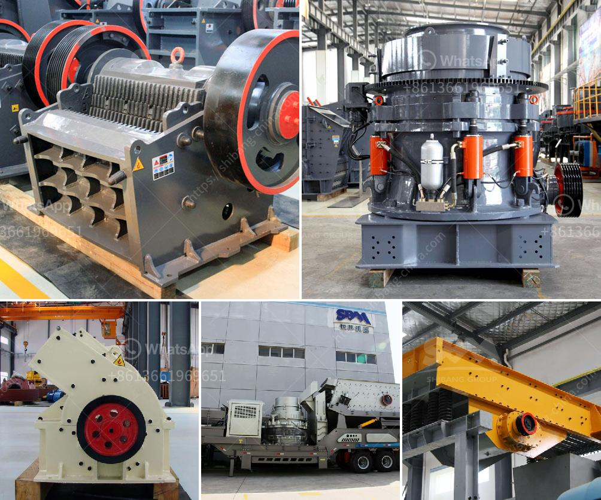

<h3>construction hammer mill</h3>
A construction hammer mill is a relatively simple but efficient tool that many construction workers and contractors use to break down materials and debris on the job site. Its main purpose is to crush and reduce the size of construction waste, such as concrete, bricks, and asphalt, into small and manageable pieces that can be recycled or disposed of properly. In this article, we will delve deeper into the working mechanism of a construction hammer mill and its uses in the construction industry.

The construction hammer mill consists of a rotor, which revolves at high speed within a metal casing. This rotor contains a series of hammers or metal plates that strike and break down the materials passing through the mill. The size and shape of the hammers can vary, depending on the desired output size and the type of material being processed.

When the construction waste is fed into the hammer mill, it is immediately struck by the rotating hammers, which forcefully crush it against the metal plates. This impact creates a rapid and powerful fragmentation, reducing the size of the material into smaller pieces. The crushed debris then passes through small holes or openings in the metal casing, preventing oversized materials from exiting the mill.

One of the main advantages of using a construction hammer mill is its versatility. It can process a wide range of materials, including concrete, bricks, asphalt, wood, and even certain metals. This versatility makes it an invaluable tool for construction workers, as it eliminates the need for separate machines to handle different types of waste.

Another significant advantage of the construction hammer mill is its efficiency in waste management. By breaking down materials into smaller pieces, it allows for easier and more efficient disposal or recycling. Crushed concrete and bricks, for example, can be used as aggregate in new construction projects, while shredded wood can be turned into mulch or biomass fuel. Recycling materials through the use of a construction hammer mill not only reduces landfill waste but also helps conserve natural resources and minimize environmental impact.

Furthermore, a construction hammer mill can save time and money for construction projects. Instead of hiring separate machines or trucking waste to disposal facilities, contractors can process construction debris on-site using a hammer mill. This significantly reduces transportation costs and promotes a cleaner and safer work environment.

It is worth noting that safety is a crucial consideration when operating a construction hammer mill. Proper training and adherence to safety guidelines are necessary to prevent accidents and injuries. Operators should wear appropriate protective gear and ensure that the mill is properly guarded to prevent access to moving parts.

In conclusion, a construction hammer mill is a powerful and efficient tool that is widely used in the construction industry. It crushes and reduces the size of construction waste, making it easier to manage and recycle. With its versatility, efficiency, and cost-saving benefits, a construction hammer mill is a must-have equipment for any construction project.
<h3>Contact us</h3><ul><li><strong>Whatsapp:&nbsp;<a href="https://wa.me/8613661969651">+8613661969651</a></strong></li><li><a href="https://swt.shibang-china.com/?git&amp;zhl&amp;construction hammer mill"><strong>Online Service(chat now)</strong></a></li></ul><h3>Related</h3><ul><li><a href='gold milling plant in zimbabwe.md'>gold milling plant in zimbabwe</a></li><li><a href='roll mill machine.md'>roll mill machine</a></li><li><a href='mini copper ore extraction plant.md'>mini copper ore extraction plant</a></li><li><a href='industerial ball mill for sale.md'>industerial ball mill for sale</a></li><li><a href='limestone manufacturing process.md'>limestone manufacturing process</a></li></ul>