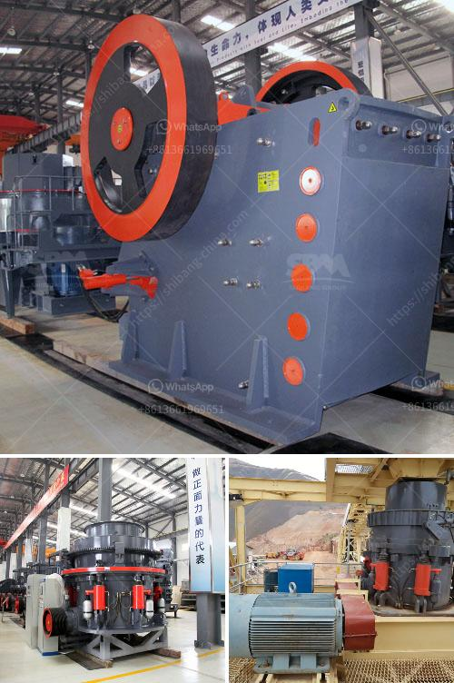

<h3>construction material recycling technology</h3>
Construction activity plays a fundamental role in modern society, shaping and supporting our built environment. However, the industry's environmental impact, particularly regarding waste generation, has become a pressing issue worldwide. Fortunately, the advent of construction material recycling technology offers a glimmer of hope in mitigating this problem.

Traditionally, construction waste was disposed of in landfills, posing significant environmental and economic challenges. Landfills not only occupy vast amounts of land but also release harmful greenhouse gases as a byproduct of waste decomposition. Moreover, as the global demand for non-renewable resources steadily increases, it is imperative to find sustainable alternatives that optimize the use of available materials.

Construction material recycling technology provides the key to a sustainable future by diverting construction waste from landfills and maximizing the potential of recyclable materials. This innovative approach involves the recovery, processing, and repurposing of various construction materials, such as concrete, wood, steel, and asphalt.

Concrete recycling, for instance, is one of the most significant advancements in construction material recycling technology. Concrete waste, often generated during building demolitions or renovations, can be crushed, processed, and reused as aggregate in new concrete mixtures. Recycling concrete not only reduces the demand for virgin aggregates but also saves energy and reduces carbon emissions associated with the production of new concrete.

Wood recycling is another crucial aspect of this technology. Wood waste from construction sites, including timber offcuts, plywood, and pallets, can be repurposed for various applications. By converting wood waste into alternative products like mulch, composite decking, or even biomass fuel, we can prevent unnecessary logging and reduce pressure on our forests.

Steel, a vital component in construction, can be efficiently recycled as well. Steel recycling technology enables the recovery of steel from construction waste and its transformation into new products. This process significantly conserves energy, as recycling steel requires less energy compared to producing it from raw materials, thereby reducing carbon emissions and preserving finite resources.

Asphalt recycling technology has also revolutionized the construction industry. It involves the reuse of old asphalt pavements, either by processing them on-site or at a recycling facility. Through this method, worn-out asphalt can be rejuvenated and used in new road construction, minimizing the need for virgin asphalt materials. This not only conserves resources but also reduces landfill waste and saves substantial costs associated with new asphalt production.

In addition to the environmental benefits, construction material recycling technology has compelling economic advantages. The reuse of materials eliminates the need for costly landfill disposal, reducing waste management expenses for construction companies. Furthermore, recycled materials can be acquired at a reduced cost compared to their virgin counterparts, offering potential savings for future construction projects.

Despite its numerous advantages, construction material recycling technology still faces some challenges. The identification and separation of different materials at construction sites can be a complex and time-consuming task. Additionally, ensuring consistent quality standards for recycled materials is vital to gain industry acceptance and overcome any resistance from stakeholders.

To overcome these challenges and accelerate the adoption of recycling technologies, governments and industry stakeholders must collaborate to develop robust waste management policies and invest in infrastructure for sorting, processing, and recycling materials. Educating construction professionals about the benefits of recycling and providing training on proper waste separation practices is also crucial.

In conclusion, construction material recycling technology paves the way for a sustainable construction industry. By diverting waste from landfills and maximizing the potential of recyclable materials, this technology reduces the industry's environmental impact, conserves resources, and promotes a circular economy. Embracing these technologies will undoubtedly contribute towards a greener future for the construction industry and the planet as a whole.
<h3>Contact us</h3><ul><li><strong>Whatsapp:&nbsp;<a href="https://wa.me/8613661969651">+8613661969651</a></strong></li><li><a href="https://swt.shibang-china.com/?git&amp;zhl&amp;construction material recycling technology"><strong>Online Service(chat now)</strong></a></li></ul><h3>Related</h3><ul><li><a href='calcium carbonate for ball mill.md'>calcium carbonate for ball mill</a></li><li><a href='jaw stone crusher for excavators.md'>jaw stone crusher for excavators</a></li><li><a href='micro powder grinding mill prices.md'>micro powder grinding mill prices</a></li><li><a href='grinding mill for limestone italy.md'>grinding mill for limestone italy</a></li><li><a href='what is cost for putting up a 2500 tpd cement plant.md'>what is cost for putting up a 2500 tpd cement plant</a></li></ul>