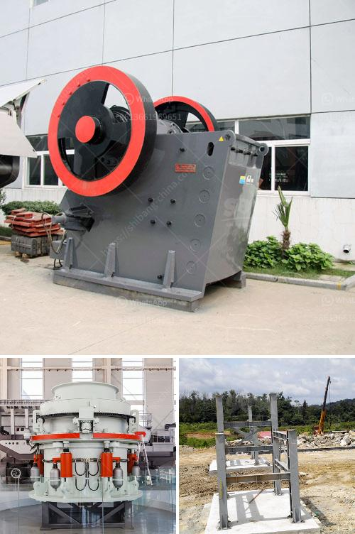

<h3>construction of a clinker plant</h3>
The construction of a clinker plant is undoubtedly a remarkable endeavor in the field of construction and engineering. A clinker plant serves as a critical component in the cement manufacturing process. It acts as a melting pot, where limestone and other raw materials are heated to high temperatures, eventually transforming into clinker. This clinker is then finely ground to produce cement, an essential building material.

Key considerations in the construction of a clinker plant revolve around efficiency, safety, and sustainability. The initial step involves selecting an optimal location for the plant. Proximity to limestone mines and sources of other raw materials is crucial to minimize transportation costs and promote efficiency in manufacturing. Additionally, a thorough environmental impact assessment is necessary to safeguard the surrounding ecosystem.

The construction phase involves various stages, beginning with the design and layout of the plant. The chosen design should accommodate all the necessary machinery, as well as provide ample space for storage, processing, and packaging. The foundation and structural elements must be designed to handle substantial loads, ensuring the durability and longevity of the plant.

Efficient energy consumption and waste management systems are fundamental aspects of a modern clinker plant. The installation of heat exchangers and other energy-saving technologies helps reduce carbon emissions and decrease operational costs. Utilizing advanced filters and dust collectors prevents air pollution and fosters a safe working environment for employees.

Safety measures during the construction process cannot be overstated. Strict adherence to safety standards and procedures, including the correct usage of personal protective equipment, ensures the well-being of workers. Regular inspections and quality control checks are essential for maintaining high standards and avoiding potential hazards.

Lastly, sustainability is an essential aspect of any clinker plant. Incorporating renewable energy sources, such as solar or wind power, into the plant's operations contributes to reducing the carbon footprint. Utilizing recycled or alternative materials as inputs, where possible, also promotes eco-conscious construction.

In conclusion, the construction of a clinker plant is a complex yet vital undertaking in the construction industry. From selecting the optimal location to implementing energy-saving technologies and ensuring safety, every aspect plays a crucial role in building a successful and sustainable clinker plant. Investing in the construction of a clinker plant not only promotes economic growth but also contributes to a greener future for the cement industry.
<h3>Contact us</h3><ul><li><strong>Whatsapp:&nbsp;<a href="https://wa.me/8613661969651">+8613661969651</a></strong></li><li><a href="https://swt.shibang-china.com/?git&amp;zhl&amp;construction of a clinker plant"><strong>Online Service(chat now)</strong></a></li></ul><h3>Related</h3><ul><li><a href='small cement grinding plant.md'>small cement grinding plant</a></li><li><a href='used stone crusher plant for sale in uk.md'>used stone crusher plant for sale in uk</a></li><li><a href='cinder block crushing machines for rent.md'>cinder block crushing machines for rent</a></li><li><a href='crushing of gold mining dust.md'>crushing of gold mining dust</a></li><li><a href='jaw stone crusher for excavators.md'>jaw stone crusher for excavators</a></li></ul>