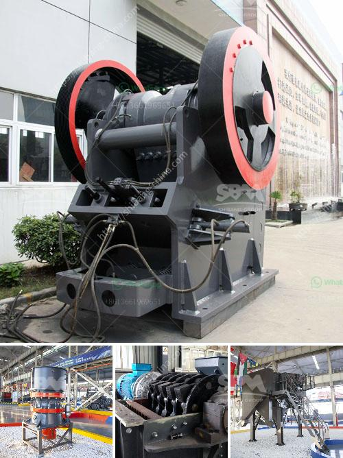

<h3>construction of vibrating screen</h3>
The construction of a vibrating screen is a complex task as it encompasses a variety of different aspects. From the design and fabrication of the components to the final assembly, these measures ensure that the equipment meets the specific requirements of the application. 

A vibrating screen consists of many different components, such as a frame, vibrating mechanism, springs, screen decks, liners, etc. These components are essential in the proper functioning of the equipment. The choice of material, shape, and size of these components depends on the application and the nature of the material to be screened. 

The frame of the vibrating screen is typically made of welded steel. It consists of a base, side plates, cross beams, and support structures. The vibrating mechanism is responsible for activating the vibrating screen. It comprises a shaft with two bearings and counterweights. This means that the bearings are mounted onto the eccentric shaft, enabling the shaft to rotate. 

To ensure proper operation and prevent any failure during the working life of the vibrating screen, it is necessary to install adequate springs. The springs are placed on the vibrating frame, and they help in reducing the dynamic forces transmitted to the support structure. Additionally, they provide isolation between the vibrating screen and the support structure, preventing the transmission of vibrations to surrounding equipment and structures. 

The screen decks on a vibrating screen are fabricated from perforated steel plates, polyurethane, or rubber. The screening media can be woven wire panels, perforated plates, or synthetic materials. Differently sized holes or openings are used to screen different-sized materials. 

Lastly, the liners inside the vibrating screen help protect the screen decks and prolong their service life. The liners are made of wear-resistant materials such as rubber or polyurethane. They are essential in ensuring that the screen decks do not wear out quickly due to abrasion or impact. 

Overall, the construction of a vibrating screen requires careful consideration of various factors, including the application, material to be screened, and throughput requirements. By selecting the appropriate components and ensuring proper assembly, a vibrating screen can efficiently and effectively perform its intended function.
<h3>Contact us</h3><ul><li><strong>Whatsapp:&nbsp;<a href="https://wa.me/8613661969651">+8613661969651</a></strong></li><li><a href="https://swt.shibang-china.com/?git&amp;zhl&amp;construction of vibrating screen"><strong>Online Service(chat now)</strong></a></li></ul><h3>Related</h3><ul><li><a href='stone crusher plan dwg.md'>stone crusher plan dwg</a></li><li><a href='used crushing quarry plant in south africa.md'>used crushing quarry plant in south africa</a></li><li><a href='china cement grinding unit manufacturers.md'>china cement grinding unit manufacturers</a></li><li><a href='quarry crusher for sale.md'>quarry crusher for sale</a></li><li><a href='zevith simple stone crushers kenya.md'>zevith simple stone crushers kenya</a></li></ul>