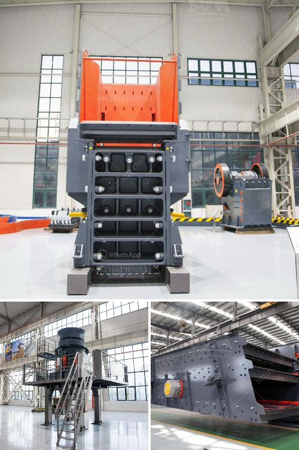

<h3>conveyor belt distributors in cebu</h3>
Conveyor belt systems have become an integral part of the manufacturing and production industry worldwide. These automated systems play a crucial role in streamlining processes, improving efficiency, and minimizing manual labor. In Cebu, Philippines, the demand for conveyor belts has surged in recent years, leading to the emergence of reliable conveyor belt distributors.

Conveyor belt distributors in Cebu offer a wide range of conveyor belt solutions tailored to various industries, including food processing, mining, logistics, and automotive manufacturing. These distributors not only provide high-quality conveyor belts but also offer comprehensive services such as installation, maintenance, and repair.

One of the key advantages of collaborating with conveyor belt distributors is their expertise in understanding the specific requirements of each industry. They possess in-depth knowledge of the latest technological advancements in conveyor belt systems and can recommend suitable solutions that meet the unique needs of businesses in Cebu.

The conveyor belt distributors in Cebu source their products from reputable manufacturers, ensuring top-notch quality and reliability. These conveyor belts are built to withstand heavy loads, extreme temperatures, and harsh working conditions. With durability as a prime focus, these belts allow businesses to operate smoothly, thereby minimizing downtime and increasing productivity.

Not only do conveyor belt distributors offer a wide variety of conveyor belt types, including flat belts, timing belts, and modular belts, but they also provide customization options. This means that businesses in Cebu can enjoy tailor-made solutions that perfectly align with their operational requirements.

In addition to their expertise and quality products, conveyor belt distributors in Cebu prioritize excellent customer service. They understand that efficient and timely after-sales support is essential for maintaining the smooth functioning of conveyor belt systems. These distributors offer prompt technical assistance, spare parts availability, and regular maintenance services to ensure the longevity and optimal performance of the conveyor belts.

Conveyor belt distributors in Cebu play a vital role in shaping the modern industrial landscape of the region. Their commitment to delivering efficient solutions, top-notch products, and excellent customer service has earned them a trusted reputation. By partnering with these experienced distributors, businesses in Cebu can enhance their operational efficiency, reduce costs, and gain a competitive edge in the global market.
<h3>Contact us</h3><ul><li><strong>Whatsapp:&nbsp;<a href="https://wa.me/8613661969651">+8613661969651</a></strong></li><li><a href="https://swt.shibang-china.com/?git&amp;zhl&amp;conveyor belt distributors in cebu"><strong>Online Service(chat now)</strong></a></li></ul><h3>Related</h3><ul><li><a href='kenya electrical jaw crusher 32 x 58.md'>kenya electrical jaw crusher 32 x 58</a></li><li><a href='used concrete mixer for sale dubai.md'>used concrete mixer for sale dubai</a></li><li><a href='ballast crusher for sale.md'>ballast crusher for sale</a></li><li><a href='crusher plants for sale.md'>crusher plants for sale</a></li><li><a href='demolition plants crushers in lima.md'>demolition plants crushers in lima</a></li></ul>